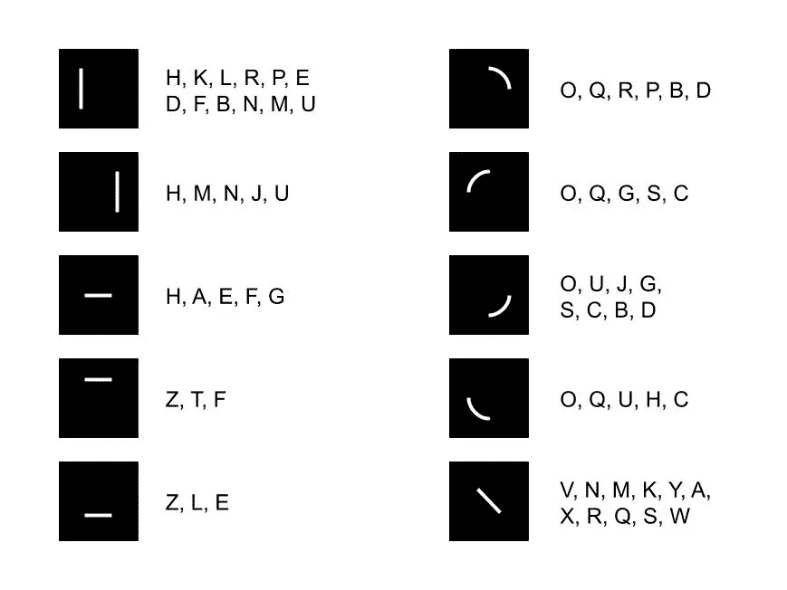
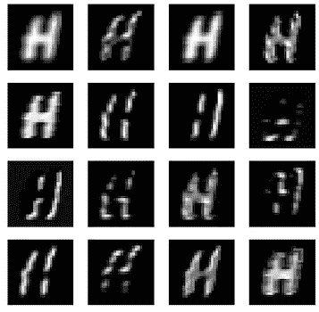

# 零起点学习字母字符

> 原文：<https://towardsdatascience.com/zero-shot-learning-the-alphabetic-characters-an-experiment-with-code-d1a0f23f4b4c?source=collection_archive---------48----------------------->

## *能否识别训练中未提供的字母字符？*

在这篇文章中，我想解释并实际演示一个被称为**零射击学习**的机器学习领域，我发现这真的很有趣。让我们先简单描述一下它到底是什么:

> 零射击学习是一种识别类别的方法，这种方法在训练中没有观察到。

与传统的监督学习方法相比，传统的监督学习方法依赖于每个类别的大量示例，零射击学习的主要思想是基于从观察到的类别到新看到的类别的**语义转移**。

> 想象一下，你这辈子都没见过字母“H”。如果我告诉你它是由两条垂直线和中间的一条水平线连接而成的呢？你能认出它吗？

15 个手动设计功能中的 10 个。图片作者。

这种语义转换的关键是**将类别编码为语义空间中的向量**。这对于培训和测试类别都是需要的，并且可以以监督或非监督的方式来完成。

**监督方式**将通过提出一些特征*来手动注释类别，例如，狗=有尾巴、有皮毛、有四条腿等。*并将它们编码成类别向量。这些特征也可以取自给定领域中已经存在的分类法。

**一种不受监督的方式**是对类别名称使用单词嵌入。这是因为单词嵌入已经根据类别名称出现在文本中的上下文(例如，在维基百科语料库中)捕获了类别的语义。

## 实验

我决定使用监督的方式，自己创建类别向量，这样我就可以更深入地了解最终的模型。因此，我开始寻找一个具有合理数量类别的任务，对于它来说，提出有意义的特性是可行的。正如你已经知道的，我用*字母字符*结束，使用 [A-Z 手写字母](https://www.kaggle.com/sachinpatel21/az-handwritten-alphabets-in-csv-format)数据集。

下一步是为所有 26 个类别(字母表中的字符)设计功能。这些特征必须足够通用，因此它们总是涵盖一个以上的类别，然而，每个类别都必须由一组**独特的特征**来描述，以便以后能够区分。总之，我想出了满足这些限制的 15 个特征(第一幅图中显示了其中的 10 个)。

之后，我必须划分数据集，决定哪些字符将被用作*零拍类别*。为此，我选择了五个特征相对不同的字符(“J”、“D”、“H”、“R”、“Z”)，并将它们的所有数据放在一边。具有剩余 21 个类别的*的数据集的剩余部分在训练集和测试集之间分割，用于拟合和测试模型。*

有几种方法可以创建零起点学习的模型。我想尝试最简单的方法，它简单地预测任何给定输入的特性。该模型的输入是角色的图像，目标是其编码的类别向量(每个特征为 0 或 1)。这个任务可以被视为一个**多标签分类**，为此我在 Keras 中使用了以下两个卷积层的设置。

为了评估和实际使用经过训练的模型，我必须以某种方式将预测的类别向量映射回它们对应的类别。这是使用具有欧几里德距离的**最近邻匹配**完成的。首先，我使用*测试集*在观察到的类别上评估模型，达到了 *96.53%* 的准确率。

当我知道该模型能够正确概括时，我可以开始在*看不见的零射击类别*上评估它。基于[这篇论文](https://arxiv.org/abs/1707.00600)，我发现实际上有两种方法可以评估零炮模型。

第一个是某种限制性的设置，在预测的时候，我们知道这个实例是来自可见的还是不可见的类别。零触发学习为此受到了批评，因为在现实世界的应用中，我们通常没有这些可用的信息。我们的模型在被搁置的数据上这样评估，达到了 *68.36%* 的准确率。

第二种设置考虑了预测时所有可能的类别。处理这个问题的领域叫做**广义零射击学习**。以这种方式评估的结果通常低得多，因为观察到的类在搜索空间中充当干扰物。我们的情况也是如此，基于相同数据评估的模型仅达到了 *10.83%* 的准确度。对字符“R”的预测几乎总是更接近“P”，对“J”的预测更接近“U”，等等。解决这个问题的一种方法可以在本文中找到。

## 结论

这个实验让我第一次很好地了解了零起点学习的领域，以及从中可以期待什么。我希望它对你也一样。我必须承认，我期待一个更好的表现，主要是在广义的设置。然而，我使用的模型非常简单，当然可以使用更复杂的模型。一种看起来很有前途的方法，也是我想在未来尝试的方法，是使用**双线性模型**。该模型使用图像和类别向量作为输入，并预测该向量是否属于图像的实际类别。

感谢您的阅读。所有的代码都可以在这个 [kaggle 笔记本](https://www.kaggle.com/sebastianpoliak/zero-shot-learning-the-alphabetic-characters)中找到，所以你可以随意试验和训练你自己的模型。我将留给你一个卷积层的*可视化，因为我很好奇它是否看起来有点类似于我设计的功能。*

第一卷积层的特征图。图片作者。

 [## 通过观察偏差和方差来系统地调整你的模型

### 有没有想过是否有比盲目猜测超参数或…更系统的方法来调整您的模型

towardsdatascience.com](/systematically-tuning-your-model-by-looking-at-bias-and-variance-4986662315b2)  [## 主动学习能节省多少时间？

### 在 NLP 数据集上的动手实验。

towardsdatascience.com](/how-much-time-can-you-save-with-active-learning-b4886f5da462)