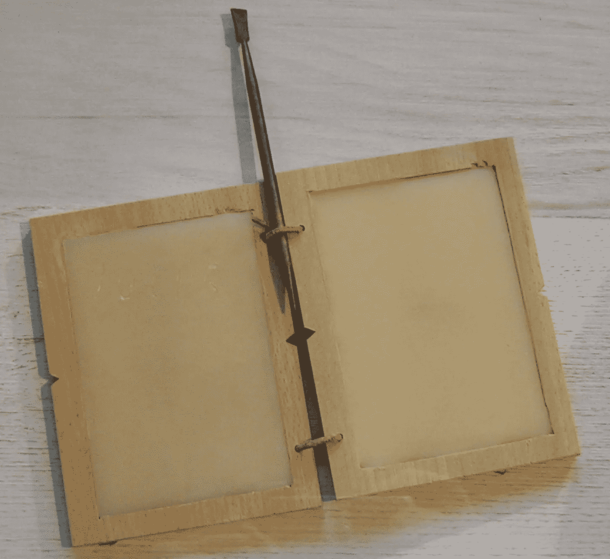
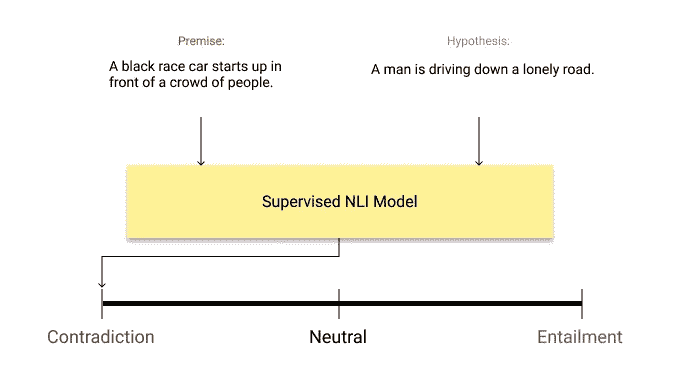
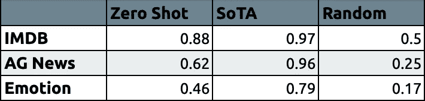

# 零镜头文本分类和评估

> 原文：<https://towardsdatascience.com/zero-shot-text-classification-evaluation-c7ba0f56688e?source=collection_archive---------16----------------------->

最近，零镜头文本分类由于其简单性引起了人们极大的兴趣。在这篇文章中，我们将看到如何使用零镜头文本分类和任何标签，并解释背景模型。然后，我们将在情感分析、新闻分类和情感分类中使用人工标注数据集来评估它的性能。

**零镜头文本分类**

在零镜头文本分类中，该模型可以在没有任何先验数据的情况下对给定标签之间的任何文本进行分类。



白板(图片由[维基百科](https://en.wikipedia.org/wiki/Tabula_rasa)提供)

使用零触发文本分类，可以执行:

*   情感分析
*   新闻分类
*   情感分析

# **背景**

实际上，零镜头文本分类的最新实现源于一个非常简单但非常棒的想法。自然语言处理中有一个领域叫做自然语言推理(NLI)。这个领域研究一个假设对于一个给定的前提是真的(蕴涵)，假的(矛盾)，还是不确定的(中性)。



监督 NLI 系统

现在，让我们假设我们的文本是*“我爱这部电影。”*我们想要预测候选标签*正*和*负*之间的文本的情感。我们将这两个假设-前提对给已经训练好的 NLI 模型，并检验结果。

> *前提:*我爱这部电影。
> *假设-1:* 本例为**正**。
> 
> *前提:*我爱这部电影。
> *假设——2:*这个例子是**否定**。

基本上，它为每个类别创建“此示例是…”的假设模板，以预测前提的类别。如果推论是蕴涵，就意味着前提属于那个类。在这种情况下，它是积极的。

# **代码**

得益于 HuggingFace，可以通过[管道模块](https://huggingface.co/transformers/main_classes/pipelines.html#transformers.ZeroShotClassificationPipeline)轻松使用。

```
#!pip install transformers datasets
from transformers import pipelineclassifier = pipeline("zero-shot-classification", device=0) #GPUcandidate_labels = ["positive", "negative"]
text = "I don't know why I like this movie so well, but I never get tired of watching it."
classifier(text, candidate_labels)> {'labels': ['positive', 'negative'],
> 'scores': [0.8987422585487366, 0.10125774145126343],
> 'sequence': "I don't know why I like this movie so well, but I
never get tired of watching it."}
```

在第一个示例中，我们从 transformers 管道中初始化分类器，然后从 [IMDB 数据集](http://ai.stanford.edu/~amaas/data/sentiment/)中给出一个示例。您可以看到分类器为每个标签生成了分数。在第一个例子中，它正确地预测文本的情感是积极的。

```
candidate_labels = ["world", "sports", "business", "sci/tech"]
text = "Quality Gets Swept Away Quality Distribution is hammered after reporting a large loss for the second quarter."
classifier(text, candidate_labels)> {'labels': ['business', 'world', 'sci/tech', 'sports'],
> 'scores': [0.8066419363021851,   0.16538377106189728,   0.018306914716959,   0.009667363949120045],
> 'sequence': 'Quality Gets Swept Away Quality Distribution is hammered after reporting a large loss for the second quarter.'}
```

我们的第二个例子是来自 [AG 新闻数据集](http://groups.di.unipi.it/~gulli/AG_corpus_of_news_articles.html)的新闻分类。它能正确预测商业类新闻。

```
candidate_labels = ["anger", "fear", "joy", "love", "sadness", "surprise"]
text = "i didnt feel humiliated"
classifier(text, candidate_labels)> {'labels': ['surprise', 'joy', 'love', 'sadness', 'fear', 'anger'],
> 'scores': [0.66361004114151,   0.1976112276315689,   0.04634414240717888,   0.03801531344652176,   0.03516925126314163,   0.01925000175833702],
> 'sequence': 'i didnt feel humiliated'}
```

在我们的上一个例子中，我们研究了来自[情感数据集](https://github.com/dair-ai/emotion_dataset)的一个例子。零镜头分类模型预测句子“我不觉得丢脸”的情感为*惊喜，*然而金标是*悲伤*。

# **评估**

在这些例子中，零射击分类看起来很有希望。然而，它的性能应该通过使用已经标记的例子用正确的测量来评估。


摘樱桃？？？Andriyko Podilnyk 在 [Unsplash](https://unsplash.com?utm_source=medium&utm_medium=referral) 上拍摄的照片

通过使用 HuggingFace 最新的[数据集库](https://github.com/huggingface/datasets)，我们可以很容易地在几个数据集上评估它的性能。

*   [IMDB 数据集](http://ai.stanford.edu/~amaas/data/sentiment/):情感分析
    类:*正，负*
*   [AG-News 数据集](http://groups.di.unipi.it/~gulli/AG_corpus_of_news_articles.html):新闻分类
    类:*世界*，*体育*，*商业*，*科技*
*   [情感数据集](https://github.com/dair-ai/emotion_dataset):情感分类
    类:*愤怒*，*恐惧*，*喜悦*，*爱情*，*悲伤*，*惊喜*

让我们将我们的零镜头文本分类模型与最先进的模型和微平均 F1 中的随机选取进行比较。



不同数据集中的微观平均 F1

有关初始化零射击分类管道和评估代码的更多详细信息，请查看这篇精心准备的 Colab 笔记本:

[](https://colab.research.google.com/drive/14NuJFnW3hsKNYvy0t37S0x3YYRhrxJ47?usp=sharing) [## 零镜头文本分类—谷歌联合实验室

### 详细的讲解和评价！

colab.research.google.com](https://colab.research.google.com/drive/14NuJFnW3hsKNYvy0t37S0x3YYRhrxJ47?usp=sharing) 

# 结论

我们可以看到零镜头文本分类在情感分析和新闻分类中取得了显著的效果。在具有 6 类的情感分类中的表现相当差。我相信这可能是由于类之间的相似性。在没有任何先验数据的情况下，很难区分快乐、爱和惊喜类。

如预期的那样，对于每个任务，零镜头分类的性能低于监督模型。即便如此，如果你没有任何具体分类问题的数据，还是值得尝试的*！*

*最初发表于*[*【https://akoksal.com】*](https://akoksal.com/articles/zero-shot-text-classification-evaluation)*。*

*在 Twitter 上关注我:*[https://twitter.com/alkksl](https://twitter.com/alkksl)