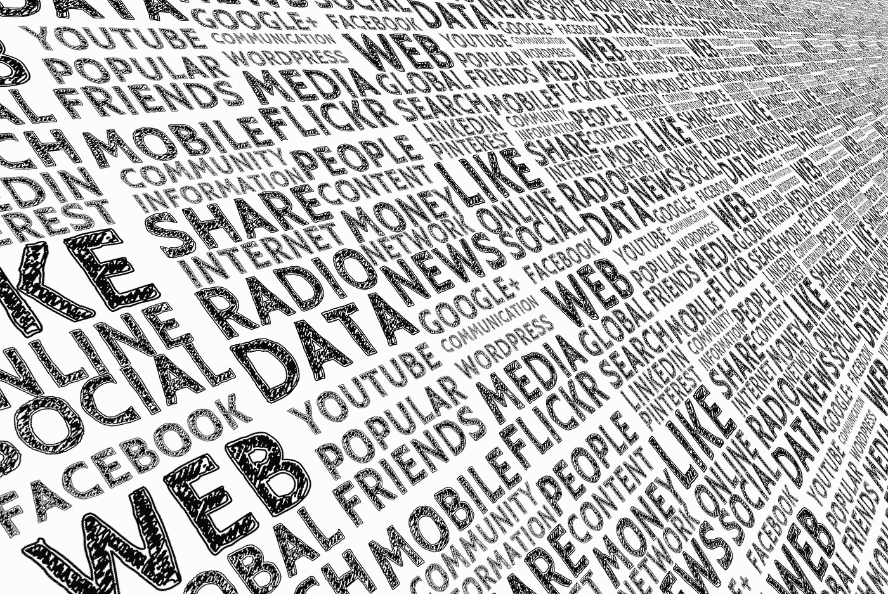
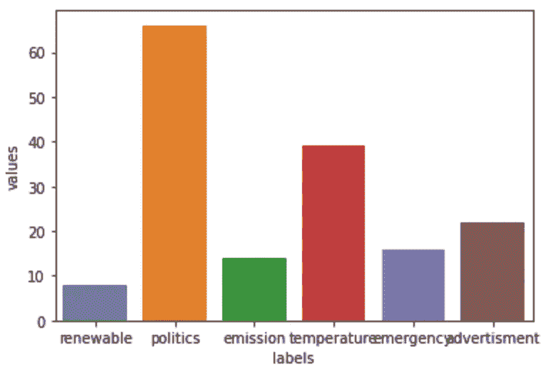

# 拥抱人脸的零镜头文本分类

> 原文：<https://towardsdatascience.com/zero-shot-text-classification-with-hugging-face-7f533ba83cd6?source=collection_archive---------5----------------------->

## 这篇文章是关于以无监督的方式检测文本情感，使用拥抱脸零镜头文本分类模型。



由 [geralt](https://pixabay.com/users/geralt-9301/) 在 [Pixabay](https://pixabay.com/) 上拍摄的照片

几周前，我在实现 POC，其中一个要求是能够以无监督的方式检测文本情感(不需要事先有训练数据和建立模型)。更具体地说，这是关于数据提取。基于一些预定义的主题，我的任务是从文本数据中自动提取信息。在研究和寻找解决这个问题的最佳方法时，我发现拥抱脸 NLP 支持零镜头文本分类。

什么是零拍文本分类？查看这个帖子— [现代 NLP 中的零投学习](https://joeddav.github.io/blog/2020/05/29/ZSL.html)。拥抱脸团队有一个现场演示[和一个样品笔记本](https://huggingface.co/zero-shot/)。简而言之，零射击模型允许我们对数据进行分类，而这些数据不是用来建立模型的。我在这里的意思是，这个模型是由别人建立的，我们用它来运行我们的数据。

我认为这将是一个有用的例子，我获取 Twitter 消息并运行分类来将消息分组到主题中。这可以作为更复杂用例的起点。

我使用 *GetOldTweets3* 库来删除 Twitter 消息。用变形金刚进行零镜头分类很简单，我是按照拥抱脸提供的 Colab 例子来做的。

进口清单:

```
import GetOldTweets3 as got
import pandas as pd
from tqdm import tqdm
import matplotlib.pyplot as plt
import seaborn as sns

from transformers import pipeline
```

从变压器管道获取分类器:

```
classifier = pipeline(**"zero-shot-classification"**)
```

我从 Twitter 上搜集了 500 条最新消息，基于一个预定义的查询——“气候斗争”。我们将把与气候变化斗争相关的信息提取到熊猫数据框架中，然后尝试使用零镜头分类将它们分成不同的主题:

```
txt = **'climate fight'** max_recs = 500
tweets_df = text_query_to_df(txt, max_recs)
```

在零触发分类中，您可以定义自己的标签，然后运行分类器为每个标签分配一个概率。有一个选项来做多类分类，在这种情况下，分数将是独立的，每个将落在 0 和 1 之间。我将使用默认选项，当管道假设只有一个候选标签为真时，返回每个标签的分数列表，加起来为 1。

主题的候选标签——这将让我们了解人们实际上在谈论什么气候变化斗争。有些信息是简单的广告，我们想忽略它们。零镜头分类能够很好地检测广告，这有助于清理数据:

```
candidate_labels = [**"renewable"**, **"politics"**, **"emission"**, **"temperature"**, **"emergency"**, **"advertisment"**]
```

我将进入循环并对每条消息进行分类:

```
res = classifier(sent, candidate_labels)
```

然后我在检查分类结果。检查第一个标签就足够了，因为当 pipeline 假设只有一个候选标签为真时，我使用默认选项。如果分类分数大于 0.5，我会记录下来，以便进一步处理:

```
if res[**'labels'**][0] == **'renewable'** and res[**'scores'**][0] > 0.5:
    candidate_results[0] = candidate_results[0] + 1
```

从结果中，我们可以看到，政治话题主导了气候变化的讨论，也许正如所料。与排放和紧急情况相关的话题通过流行度彼此接近。大约有 20 个案例的广告来自废弃的 500 条信息:



作者:安德烈·巴拉诺夫斯基

让我们看看每个主题的一些例子。

*   **可更新**

```
Eco-friendly Hydrogen: The clean fuel of the future Germany is promoting the use of #eco-friendly hydrogen in the fight against climate change. Hydrogen can replace fossil fuels in virtually every situation, in an engine or fuel cell!
```

*   **政治**

```
This is so crazy and wrong. It’s as if the ACA isn’t better than what we had before, that the fight for voting rights doesn’t matter, or equal pay for women, or marriage equality, or the Paris climate agreement. Just because Biden isn’t what we want doesn’t mean Dems = GOP
```

*   **发射**

```
A simpler, more useful way to tax carbon to fight climate change - Vox
```

*   **温度**

```
I've noticed any time someone tries to tell me global warming is not a big deal and how climate change has happened before, my body goes into fight or flight.
```

*   **紧急情况**

```
(+ the next few years are CRUCIAL in the fight against climate change. if we don't address it, we'll pass the point of IRREVERSIBLE damage. biden supports the green new deal. trump... well, ya know.)
```

*   **广告**

```
What is your favorite party game? Have a look on @ClumsyRush https://www.nintendo.com/games/detail/clumsy-rush-switch/ #party #game #NintendoSwitch
```

分类结果非常好，我认为抱脸零拍模型做得非常好。上面的例句没有直接提到主题标签，但是它们被正确地分类了。

**结论**

使用零镜头模型的无监督文本分类允许我们在没有训练数据来训练模型时解决文本情感检测任务。相反，你依赖于一个来自变形金刚的大型训练模型。对于特定的用例，当文本基于特定的单词或术语时，最好使用基于训练集的监督分类模型。但是对于一般的主题，零射击模型非常有效。

**源代码**

*   GitHub 回购
*   在笔记本上自己运行