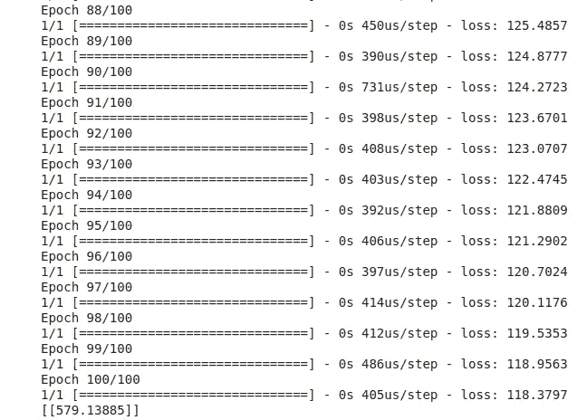
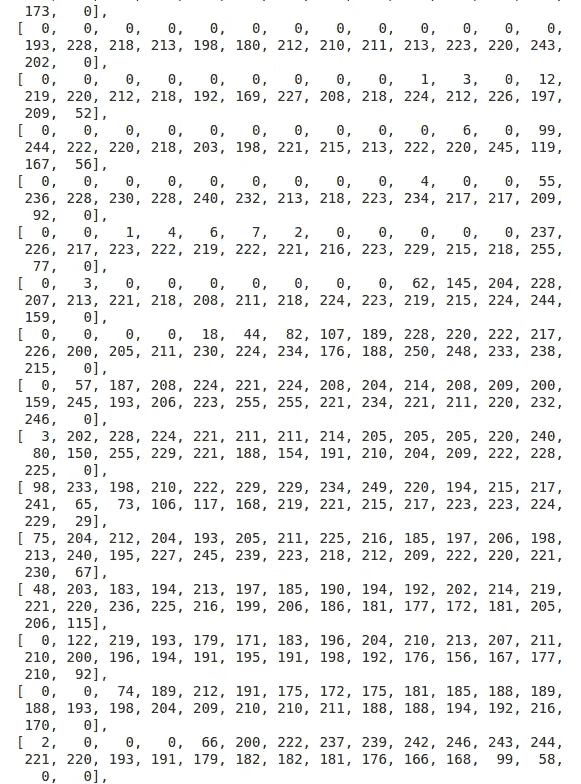
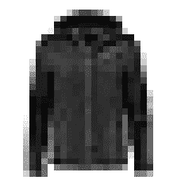
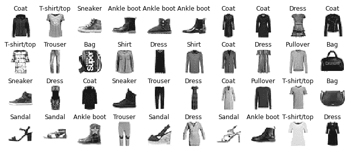
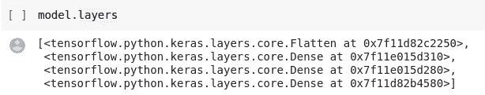
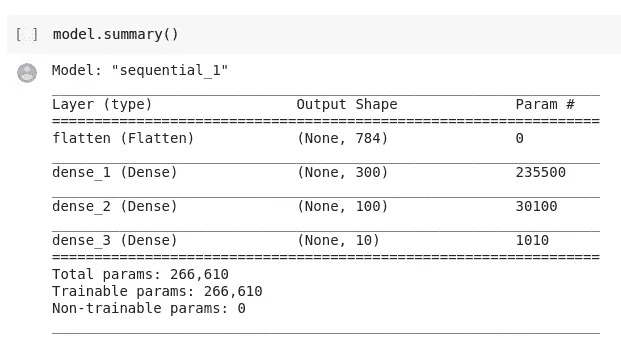
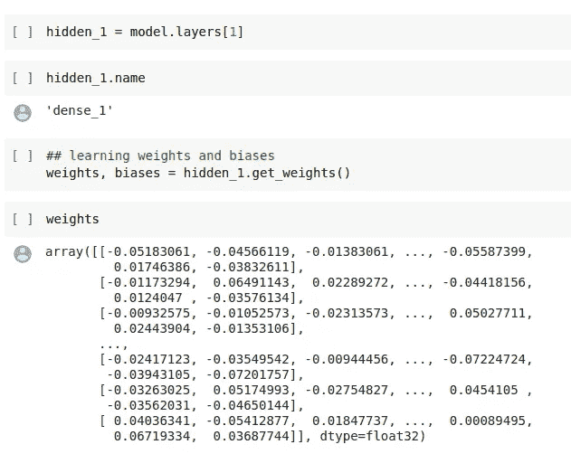
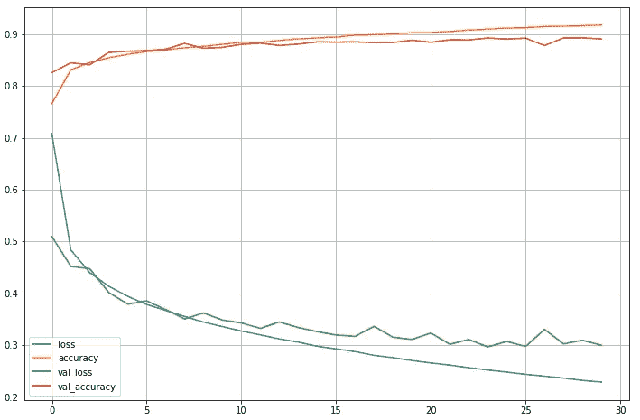
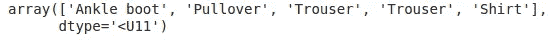
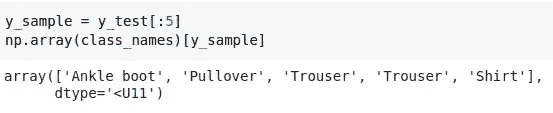

# TensorFlow 2 计算机视觉从零到英雄—第一部分

> 原文：<https://towardsdatascience.com/zero-to-hero-in-computer-vision-with-tensorflow-2-part-i-973775b9b898?source=collection_archive---------26----------------------->

## 使用 TensorFlow 开始使用神经网络的基本实现指南。


## 免责声明！

本系列不解释算法的底层数学，而只关注逻辑实现和使用带有特定参数集的特定算法的推理。学习神经网络和底层数学基础的资源包含在我的博客[中，我是如何通过 TensorFlow 开发人员证书考试的](https://medium.com/@harshit_tyagi/google-certified-tensorflow-developer-learning-plan-tips-faqs-my-journey-9f88016048e3?source=---------12------------------)。

# 计算机视觉导论

最近，计算机终于能够执行看似琐碎的任务，检测图像中的物体/有机体，甚至识别口语。

更重要的问题是，为什么这些任务对人类来说如此微不足道？
简而言之，我们的意识缺乏理解这种感知的能力，这种感知利用了大脑中专门的视觉、听觉和其他感官模块。它是如此之快，以至于当感官信息到达我们的意识时，图像、视频或音频的高级特征已经被放大了。

卷积神经网络(CNN)已经从我们大脑视觉皮层的研究中出现，它们是一种深度学习模型，普遍用于计算机视觉应用。

但是在我们深入开发 CNN 之前，让我们先研究一下深度神经网络的构建模块。

这篇博客文章通过两个例子的帮助涵盖了开发深度学习模型:

1.  **用单神经元神经网络预测房价。**
2.  **使用密集神经网络从图像中对时尚服装进行分类。**

让我们从第一个非常简单的神经网络的实现开始。

# 构建最简单的神经网络

为了对神经网络如何工作有一个基本的了解，我选择了这个非常简单的房价预测的例子。我们将根据房子里卧室的数量来预测房价。

数据遵循简单的线性函数`*y = mx + c*` *。*

这些数据仅仅是经过组织的:对于每间卧室，我们增加了 50K 美元的成本，等式中的 y 轴截距(当 x = 0 时)是 50K

我们不需要深度学习来解决这样的琐碎问题，这只是为了了解神经网络——它们是如何定义、编译、训练的，以及它们是如何进行预测的。

## 导入库

因此，第一步是导入所需的库，这里是 TensorFlow 和 NumPy:

```
##importing the main deep learningimport tensorflow as tf
from tensorflow import keras
import numpy as npprint("Tensorflow Version: ", tf.__version__)
print("Keras Version: ", keras.__version__)##output: 
Tensorflow Version:  2.3.0 
Keras Version:  2.4.0
```

确保你用的是 TensorFlow 2.x，我们已经单独导入了 Keras，可以直接使用。

## 数据

接下来，我们按照上面解释的公式定义数据:

```
bedrooms = np.array([2,3,4,5,6,7])
house_prices = np.array([150, 200, 250, 300, 350, 400])
```

## 模型定义

这将是你建立的最简单的神经网络模型。我们只需要一层，并且那层中只有一个神经元。输入形状也是`[1]`，因为我们有一维数据。

我们将使用 Keras' `Sequential` API 来创建一系列相连的层:

```
model = tf.keras.Sequential([
    tf.keras.layers.Dense(units = 1, input_shape=[1])
])
```

`units` —层中神经元的数量。

`Dense` —构建密集的神经网络。虽然这个只有一层。

`input_shape`-告诉模型输入数据的维度。

## 模型汇编和培训

如果你一直想知道数学在机器学习中的作用，这是你应该更多探索的部分。虽然，我们有令人惊讶的定义函数，很好地封装了数学。

```
# model compilation
model.compile(optimizer='sgd', loss='mean_squared_error')#model training
model.fit(bedrooms, house_prices, epochs=100)
```

我们知道我们的数据遵循一个简单的数学函数，卧室(x)和房价(y)之间的关系是

y=50x+50。

当机器试图学习那个函数时，它会进行猜测…可能是 y=5x+10。然后，`loss`函数根据实际答案评估这个猜测的答案，以测量模型预测的误差。

`optimizer`函数试图通过另一种猜测来改善这种损失。随着每一次预测，它会尽量减少损失。经过多次迭代(历元)，可能会达到一个接近 y=45x+45 的函数，这个函数仍然不正确，但更接近实际函数。

我们使用`mean_squared_error`作为优化器的损失函数和随机梯度下降(`sgd`)。

如何为特定场景找出合适的损失和优化函数是一项需要时间和实践来培养的技能。

## 模型预测法

```
print(model.predict([10]))
```



上图显示了一个 10 间卧室的房子的训练结果和图像末尾的预测值，该值应为 550，但模型预测值为 579.13。也许多训练几个时期的模型可以改进预测。你为什么不试试呢？

# **构建密集神经网络，从图像中对时尚服装进行分类**

既然我们对 TensorFlow 制作的序列模型的各个组件有了相当好的理解，那么我们解决复杂的问题就会容易得多，例如图像分类，其中包括基于手头数据的一些预处理，在模型中添加密集层，以及更改输入和输出神经元。

## 资料组

我们使用的是[时尚 MNIST 数据集](https://www.tensorflow.org/datasets/catalog/fashion_mnist)，它是著名的 MNIST 数据集的替代品。它有 70，000 张 28x28 像素的灰度图像，但这些图像代表了时尚单品。因此，每一个阶层都更加多样化，问题也比 MNIST 更具挑战性。

让我们使用 Keras 实用函数加载数据集，以获取和加载常见的数据集，包括 MNIST 和时尚 MNIST，以及其他许多数据集。

```
##loading fashion MNIST dataset from tensorflow data API
fashion_mnist = keras.datasets.fashion_mnist
(X_train, y_train), (X_test, y_test) = fashion_mnist.load_data()
```

`load_data`方法将我们的图像分成训练和测试集。

让我们检查一下训练集的形状:

```
X_train.shape##output: 
(60000, 28, 28)
```

我们的数据集中有 60，000 张图片，每张都是 28x28 像素。

类似地，我们在测试集中有 10，000 张图像。

让我们看看打印出来的图像是什么样的:

```
X_train[0]#output:
```



我们在一个 2D 阵列中有 28×28 个强度。所有这些强度都在 0-255 之间。

## 从训练集创建验证集

由于我们在这里没有验证数据，我们将进一步分割我们的训练数据以创建验证集，如下所示:

*   为验证集保留前 5000 行图像。
*   因为我们将使用梯度下降来训练神经网络，所以我们必须缩放输入特征，也就是说，我们将通过将强度除以 255.0 来将强度缩小到 0–1 范围

```
X_valid, X_train = X_train[:5000] / 255.0, X_train[5000:] / 255.0
y_valid, y_train = y_train[:5000], y_train[5000:]
X_test = X_test / 255.0
```

此外，根据数据集描述，我们在数据集中有 10 种时尚服装，它们的编码都是从 0 到 9，我们将创建这些商品的列表:

```
class_names = ["T-shirt/top", "Trouser", "Pullover", "Dress", "Coat","Sandal", "Shirt", "Sneaker", "Bag", "Ankle boot"]class_names[y_train[1]]#output: 
'T-shirt/Top'
```

## 可视化数据集

```
import matplotlib.pyplot as plt
%matplotlib inlineplt.imshow(X_train[0], cmap='binary')
plt.axis('off')
plt.show()
```



看看前 40 件衣服，

```
n_rows = 4
n_cols = 10
plt.figure(figsize=(n_cols * 1.2, n_rows * 1.2))
for row in range(n_rows):
    for col in range(n_cols):
        index = n_cols * row + col
        plt.subplot(n_rows, n_cols, index + 1)
        plt.imshow(X_train[index], cmap="binary", interpolation="nearest")
        plt.axis('off')
        plt.title(class_names[y_train[index]], fontsize=12)
plt.subplots_adjust(wspace=0.2, hspace=0.5)
plt.show()
```



## 模型定义

下一步是定义模型:

```
model = keras.models.Sequential([
    keras.layers.Flatten(input_shape=[28, 28]), # input flatten layer
    keras.layers.Dense(300, activation='relu'),
    keras.layers.Dense(100, activation='relu'),
    keras.layers.Dense(10, activation='softmax') # output layer
])
```

让我们来分解一下这个模型:

*   我们已经为密集神经网络创建了一个`Sequential` Keras 模型，该神经网络由顺序连接的单个层堆栈组成。
*   接下来，我们构建第一层，这是一个`Flatten`层，它将每个输入图像转换成一个 1D 数组:如果它接收到输入数据`X`，它将计算`X.reshape(-1, 28*28)`。它是密集层之前的一个简单的预处理层。由于它是模型中的第一层，我们指定了`input_shape`，它只包括实例的形状。
*   随后，我们添加一个有 300 个神经元的`Dense`隐藏层。它还使用 ReLU 激活功能。
*   接下来，我们添加第二个有 100 个神经元的`Dense`隐藏层，同样使用 ReLU 激活函数。
*   最后，我们添加一个有 10 个神经元的`Dense`输出层(每个类一个)，使用 softmax 激活函数(因为类是排他的)。

每个`Dense`层管理自己的权重矩阵，包含神经元及其输入之间的所有连接权重。它还管理一个偏差项向量(每个神经元一个)。

我们可以访问这些层、它们的初始化权重和偏差:



模型摘要:



权重和偏差:



## 编译和训练模型

```
model.compile(loss="sparse_categorical_crossentropy",
              optimizer="sgd",
              metrics=["accuracy"])
```

1.  **损失**:我们使用“稀疏 _ 分类 _ 交叉熵”损失，因为我们有稀疏标签(即，对于每个实例，只有一个目标类索引，在这种情况下从 0 到 9)，并且类是唯一的。
2.  **优化器**:“SGD”表示我们将使用简单的随机梯度下降来训练模型。基本上，Keras 将执行所讨论的反向传播算法。
3.  **Metrics** :由于这是一个分类问题，测量模型的准确性会很有用。

**训练:**

```
history = model.fit(X_train, y_train, epochs=30, 
                     validation_data=(X_valid, y_valid))
```

在历史对象中捕获模型训练历史，我们将使用它来绘制模型的损失和准确性。

## 模型评估

我们可以通过传递测试实例和实际标签来评估模型的性能。

```
model.evaluate(X_test, y_test)# output:
313/313 [==============================] - 0s 533us/step - loss: 0.3326 - accuracy: 0.8823
[0.3326309025287628, 0.8823000192642212]
```

该模型在这一点上具有 88%的准确性。您可以使用不同的参数来调整模型，以查看效果。

## 绘制模型历史

```
history = pd.DataFrame(history.history)
history.plot(figsize = (12,8))plt.grid(True)
```



您可以看到，历史记录有助于我们将模型训练准确性和损失与验证准确性和验证损失进行比较，即模型对未知数据的性能。

与其在训练数据上的性能相比，模型的性能总是略低。如果模型在训练和测试数据上的准确度较低，那么我们会遇到**欠拟合**的情况，但是如果模型在训练和数据上表现准确，而在验证数据上表现不太准确，那么我们会遇到**过拟合**的情况。

## 对样本测试图像进行随机预测

在测试数据集样本上运行它:

```
# extracting first 5 sample images
X_sample = X_test[:5]
y_proba = model.predict(X_sample)
y_proba.round(2)y_pred = model.predict_classes(X_sample)
y_pred#output:
array([9, 2, 1, 1, 6])
```

我们可以使用上面创建的列表获得这些服装的名称:

```
np.array(class_names)[y_pred]
```



实际标签:



您可以使用 Google Colab 笔记本试用这些模型并测试其他功能和参数:

[](https://colab.research.google.com/github/dswh/tf-end-to-end-image-classification/blob/master/Introduction.ipynb) [## 谷歌联合实验室

### 编辑描述

colab.research.google.com](https://colab.research.google.com/github/dswh/tf-end-to-end-image-classification/blob/master/Introduction.ipynb) 

> 注意:这将是一系列博客(可能有 3 个)，我们将在其中讨论基本的计算机视觉问题，用卷积对真实世界的图像进行分类&汇集并使用预先训练的模型来解决复杂的问题。

以下是这篇博客的视频版本:

# [数据科学与 Harshit](https://www.youtube.com/c/DataSciencewithHarshit?sub_confirmation=1)

通过这个渠道，我计划推出几个覆盖整个数据科学领域的[系列](/hitchhikers-guide-to-learning-data-science-2cc3d963b1a2?source=---------8------------------)。以下是你应该订阅[频道](https://www.youtube.com/channel/UCH-xwLTKQaABNs2QmGxK2bQ)的原因:

*   这些系列将涵盖每个主题和子主题的所有必需/要求的高质量教程，如[数据科学的 Python 基础](/python-fundamentals-for-data-science-6c7f9901e1c8?source=---------5------------------)。
*   解释了为什么我们在 ML 和深度学习中这样做的数学和推导。
*   [与谷歌、微软、亚马逊等公司的数据科学家和工程师](https://www.youtube.com/watch?v=a2pkZCleJwM&t=2s)以及大数据驱动型公司的首席执行官的播客。
*   [项目和说明](/building-covid-19-analysis-dashboard-using-python-and-voila-ee091f65dcbb?source=---------2------------------)实施到目前为止所学的主题。了解新的认证、训练营以及破解这些认证的资源，例如 Google 举办的 [**TensorFlow 开发者证书考试。**](https://youtu.be/yapSsspJzAw)