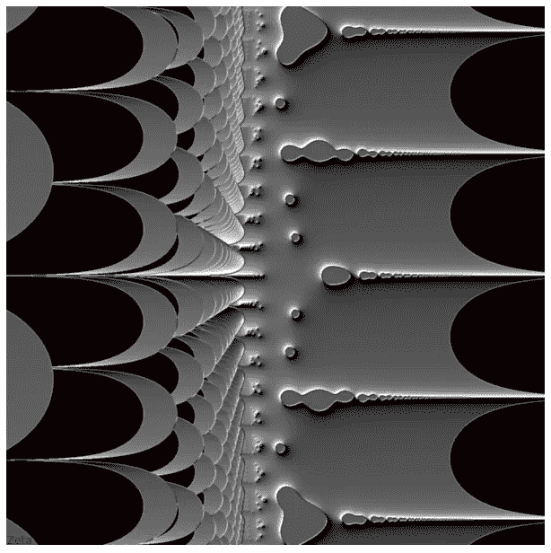
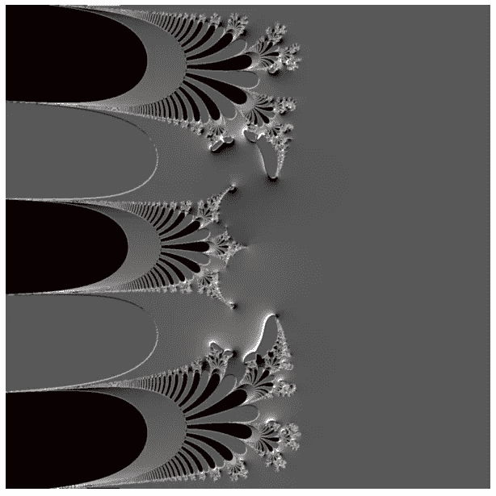
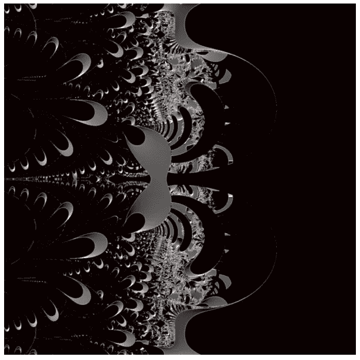
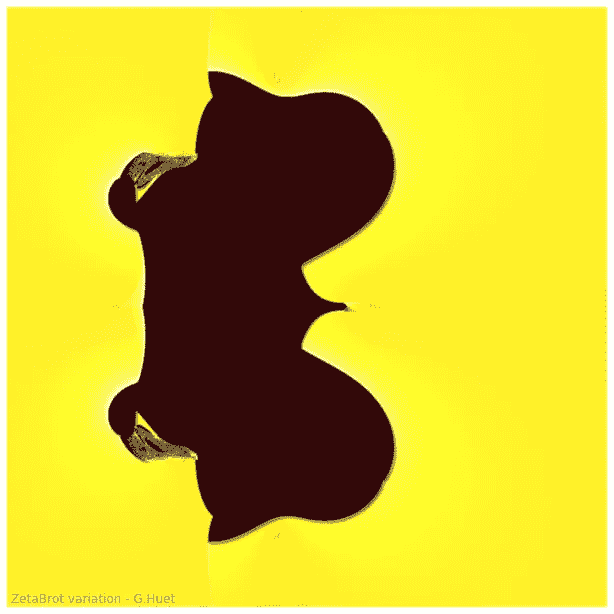
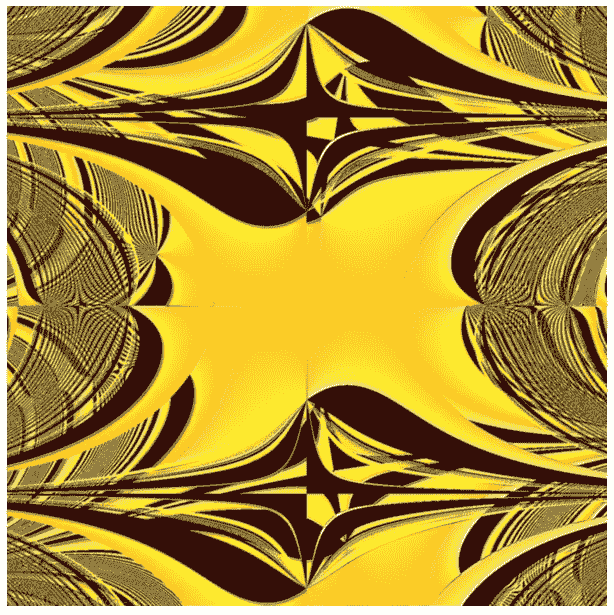
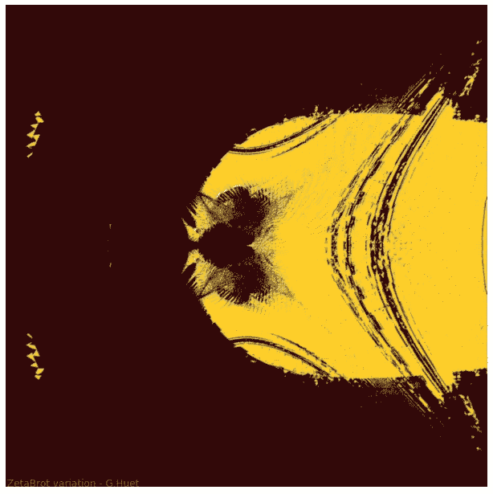

# ZetaBrot，无限分形生成器——超越 Mandelbrot 和 Zeta 函数的变体

> 原文：<https://towardsdatascience.com/zetabrot-variations-an-exploration-on-fractal-generation-8c93290bd91b?source=collection_archive---------36----------------------->

轰炸—z →( tanh(arcsinh((e^(sinh((log(arccosh((z))))^c 上的无限迭代))))))*c

除了我对数据科学的热情，数学，尤其是混沌理论，一直是我探索的主题。更准确地说，我贪婪地阅读了关于混沌系统、奇怪的吸引子和分形的数学好奇心。我觉得它们在某种意义上是令人欣慰的，看似混乱的环境中的秩序，在某种意义上是鼓舞人心的希望。Mandelbrot 集合是最著名的分形结构之一，在互联网上有数百万的参考文献。 [Github](https://github.com/search?q=mandelbrot) 统计了超过 9 种编程语言的 6000 个知识库。它已经成为开发者的游乐场，但也是网络上一些最具 T4 催眠效果的视频的来源。Mandelbrot 的美丽还来自于生成它的函数的简单性:z → z +c 的迭代。仅仅通过这个简单的公式，就可以生成一个无限的世界，其中有环路、螺旋、山谷和丰富的惊人结构。分形几何的发现对自然环境产生了巨大的影响，在自然环境中，这些图案在生物和物理世界中随处可见而且还应用于手机天线的小型化和信号处理中的图案识别，从而彻底改变了通信。

在数学的另一个分支——数论上，黎曼泽塔函数被誉为数学家的圣杯。证明[黎曼假设](https://en.wikipedia.org/wiki/Riemann_hypothesis)的天才将获得[100 万美元的奖励，由于其简单公式中隐藏的秘密，它也是激烈调查的主题。ζ函数可以简单地写成所有 1/(n^s 值的无穷和，其中 s 是一个复数。但是莱昂哈德·欧拉在 200 多年前证明了这个无穷级数等于 1/(1-p^(-s 的无穷乘积，其中 p 代表后来的素数。所以基本上，齐塔函数知道一些关于质数的事情，这是一件大事。因为质数是现代密码学的基石，也是全世界数百名](https://www.theguardian.com/science/blog/2010/nov/03/million-dollars-maths-riemann-hypothesis)[数学家爱好者](https://www.youtube.com/results?search_query=prime+numbers)和研究论文的热情主题。

在我复制这两个数学对象的可视化的卑微尝试中，我尝试了一些小的变化。其中一个经典的方法是进一步提升 Mandelbrot 集合的能力，但是这个方法又重复了很多次。然后，我试着加入一些更标准的功能，但并不总是考虑合理性，只是为了创造出视觉上的美感。因此，我的第一个变化是将齐塔函数封装在 sin 中。由此产生的视觉效果是惊人的，见下文。

z → z + sin(1/(n+0.5)^c 迭代的第一个变量)(x:-10/+10，y:-10/+10)

但随后开始了一个乏味的试错过程，在原始配方和新模式的基础上结合了几种功能。见下面第一个 Zeta 和 Mandelbrot 函数与 sin 分量的组合。

与 z → sin 的迭代的组合((z +c)/n^c) (x:-5/+5，y:-5/+5)

这是一项艰巨的工作，因为许多小的变化导致不收敛的系列。虽然经过一些调整和复制来自同行爱好者的变体([这里](https://christopherolah.wordpress.com/2010/04/23/variations-of-the-mandelbrot-set/)和[那里](https://math.stackexchange.com/questions/1099/mandelbrot-like-sets-for-functions-other-than-fz-z2c))，如[燃烧的船分形](https://en.wikipedia.org/wiki/Burning_Ship_fractal)，[垂直曼德尔布罗](http://www.fractalforums.com/movies-showcase-(rate-my-movie)/perpendicular-mandelbrot/)，我特别受到 Jeffrey Ventrella 的倡议的启发，使用遗传算法[进化曼德尔布罗集合](http://www.mandelbrotgenetics.com/)。这促使我通过创建一种算法来试验不同函数组合的自动化，该算法通过循环和随机迭代过程混合 Numpy 库中所有可用的函数，通过精心制作的适应度标准仅保留具有收敛结果的变化。目标不是找到最好的(我该如何定义它？)而是简单地生成可以聚合并导致有趣的可视化的变化。本文简介中的图片是这套的一部分。以下是一些最有希望的结果，它们的名字是由它们的形状启发而来的。有些公式也是由算法自动生成的，但是很难掌握…

藻类:z → z + 1/(n^zc) (x:-5/+5，y:-5/+5)

花园:z → e^(z + sin(1/n^c)) (x:-5/+5，y:-5/+5)

分形蝙蝠:z→ArcTan((ArcTan((Abs(1/(conj(ArcSinH(z)))))+c)(x:-5/+5，y:-5/+5)

蒙德里安:z→tan((angle(sin(sqrt(cosh(c^(cosh(abs(tan((angle(tan(z))))))))))))))(x:-5/+5，y:-5/+5)

冲击波:z→arctanh(sqrt(((c^(sqrt(arcsinh(tan(log(((arcsin(c^(tan(((conj((z)+c))+c )^n))))^(arcsin(c^(tan(((conj((z)+c))+c )^n)))))^n))))))^c)+c))(x:-5/+5，y:-5/+5)

你说对了，公式变得更加复杂，设计也变得更加复杂。但是，算法如何知道哪些组合是有效的，哪些是无效的呢？

**zeta brot——无限分形生成器**

该算法本身分 4 步工作:
1-定义复杂性的“深度”，例如 z →z +c 的复杂性深度为 2:首先是 z 的平方，然后加上 c。对于 Zeta 函数，它将是 3:首先将 n 提高到 c 的幂，然后对其求逆，最后将其加到 z 上。
我将深度限制为 20，但这是任意的。

2-对于每个复杂程度，从 34 个可用函数中选择一个(从 sin 到 square，下至 atan，甚至 re 或 Im 代表复数)。并按照步骤 1 中随机选择的复杂性级别的底部进行操作。

3.对于复杂计划的每个点，迭代结果(类似于 Mandelbrot) n 次，n 也是任意设置的，但会影响可视化(特别是对于负的 n 次方值)

4.评估结果值的平均值和标准偏差。任何射向无穷大或具有无穷小标准偏差的都被丢弃。一个简单的条件检查和阈值有助于关注最有意义的结果

它的妙处在于一个非常复杂的公式，比如:

> z→im(tan(c^(arccos(arcsinh((cosh(conj(arccos(cosh( arccos(z))))))^n)))))

可以通过算法中的主要公式组件进行总结:

【23，26，23，6，26，9，28，23，13，2，20，2】分别对应 ArcCos，CosH，conj…在我的手工参照中。

按照这种逻辑，Mandelbrot 可以表示为[7，15]，Riemann Zeta 函数可以表示为[34，10，5，17]。

由于一些伟大的数学思想家受到现有问题的新颖可视化的启发，也许一些宝石隐藏在这些模式中，可能对尚未发现的新定理感兴趣，并帮助我们在混沌中找到新的模式。

我的下一个努力将是尝试几种规模，但也增加了新的公式的变化。保持联系。

下面是我最喜欢的一个例子来总结这次探索之旅:

混乱与秩序的世界:z→((arcsinh(tan(sinh(e^((arcsinh(c^(arctanh(arccosh(arcsinh(e^(((z)+c)+c )))))))^c)))))+c

鸣谢:感谢 Python 可视化库 Matplotlib 对 Mandelbrot set 的惊人视觉效果的[渲染的详细代码分解。我仍然需要探索更多由图卢兹数学大学发布的](https://matplotlib.org/examples/showcase/mandelbrot.html)[精细着色功能](https://www.math.univ-toulouse.fr/~cheritat/wiki-draw/index.php/Mandelbrot_set)。

[纪尧姆·休特](https://www.linkedin.com/in/ghuet/)