# ZFNet:用代码解释论文

> 原文：<https://towardsdatascience.com/zfnet-an-explanation-of-paper-with-code-f1bd6752121d?source=collection_archive---------17----------------------->

## 揭开神经网络如何看待我们的世界的秘密！

丹尼尔·库切列夫在 [Unsplash](https://unsplash.com?utm_source=medium&utm_medium=referral) 上拍摄的照片

在 2013 年的 ImageNet 大规模视觉识别挑战赛(ILSVRC)中，ZFNet 受到了关注，与 [AlexNet](/alexnet-8b05c5eb88d4) 相比有了显著的改进。本文是黄金宝典，为您提供了许多概念的起点，如**深度特征可视化**、**特征不变性**、**特征进化、**和**特征重要性**。

# 体系结构

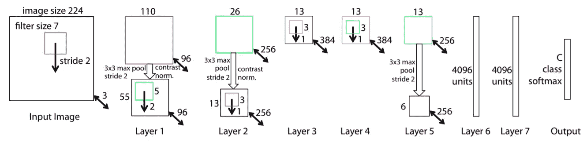

[https://arxiv.org/pdf/1311.2901.pdf](https://arxiv.org/pdf/1311.2901.pdf)

*   我们的输入是 **224x224x3** 的图像。
*   接下来，**以 2** 的**步距执行 7x7** 的 96 个卷积，随后是 **ReLU** 激活、**以 2** 步距的 3×3 最大汇集和**局部对比度归一化**。
*   接下来是 256 个 3×3 的滤波器**，每个滤波器然后再次被**局部对比度归一化**和**汇集**。**
*   第三层和第四层与 **384 个内核相同，每个**3 个。
*   第五层具有 3x3 的 **256 个过滤器，接着是具有步幅 2 的 3x3 最大池**和**局部对比度归一化**。
*   第六层和第七层分别容纳 4096 个密集的单元。
*   最后，我们输入 1000 个神经元的**密集层，即 ImageNet 中的类的数量。**

如果您不熟悉术语“局部对比度标准化”:

> **局部对比度归一化**是一种执行局部减法和除法归一化的归一化，在特征图中的相邻特征之间以及不同特征图中相同空间位置的特征之间实施一种局部竞争。

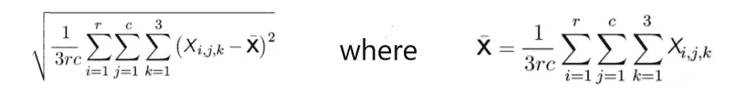

来源:[https://cedar . buffalo . edu/~ Sri Hari/CSE 676/12.2% 20 computer % 20 vision . pdf](https://cedar.buffalo.edu/~srihari/CSE676/12.2%20Computer%20Vision.pdf)

# 特征的可视化

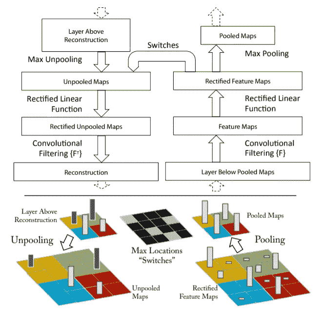

[https://arxiv.org/pdf/1311.2901.pdf](https://arxiv.org/pdf/1311.2901.pdf)

对于特征的可视化，作者使用了**去进化网络** (deconvnet)。可以把 deconvnet 看作是自动编码器的解码器部分。它与普通的卷积网络相反，它使用非 pooling 和过滤器从特征中恢复像素。

这个网络中唯一令人困惑的部分是它是如何撤销池的，因为当任何池完成时，给定使用 NxN 过滤器，N 个值中只有一个值剩余。整个数据不能被恢复，但是最大值仍然在那里，但是如果我们不知道它在卷积层的输出中的位置，它是没有用的。这就是为什么当进行汇集时存储最大值的位置以便以后使用。这些位置在文中被称为**开关**。

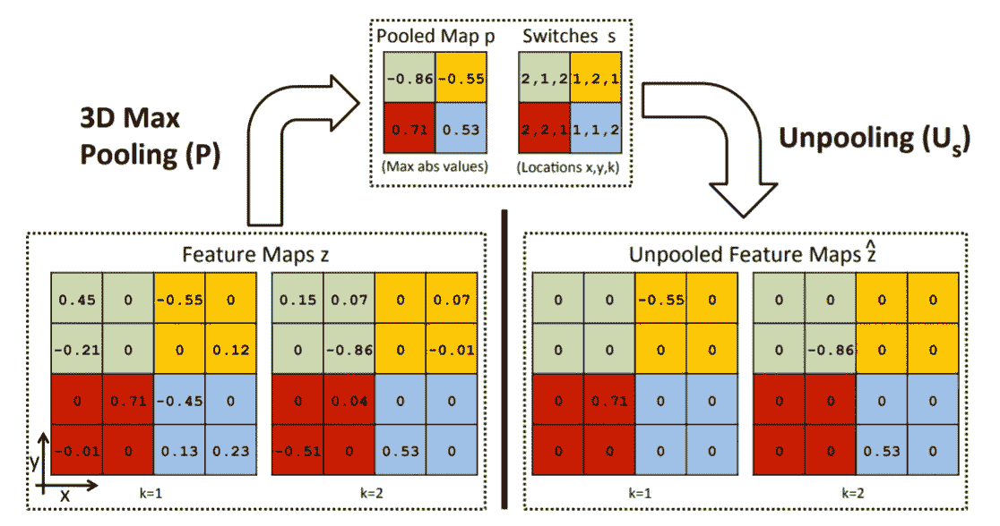

【https://ieeexplore.ieee.org/document/6126474 

使用开关，最大值被放置在图层上正确的空间位置，从而允许将要素正确映射到像素。

此外，还有一点需要注意，卷积滤波器是在应用非线性之后应用的，这与卷积然后激活的正常流程相反。

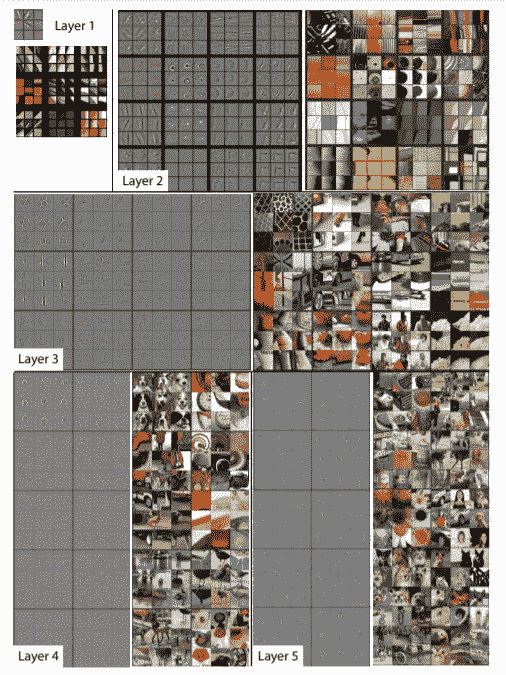

[https://arxiv.org/pdf/1311.2901.pdf](https://arxiv.org/pdf/1311.2901.pdf)

然后作者提取了特征图中前 9 个激活的特征并展示出来。

第一层去掉了最简单的特征，图像中的各种频率。**把它当成学习图像中的线条。**

第二层是建模各种角落和边缘/颜色组合。**把它想象成学习图像中的曲线。曲线是由小线条构成的。**

第三层学习网格等更复杂的图案。**把它想象成学习那些曲线的组合，即网格。曲线聚集在一起创建网格(想想篮子)。**

第四层学习特定类别的特征，例如狗脸。**把它想象成把篮子做成不同的形状并涂上不同的颜色。网格可以被转换成类似于面和各种复杂的对象。**

第五层学习具有一些姿势变化(侧面、正面和其他)的整个对象。把它想象成把所有这些篮子排列成相似的不同物体。可以将类似较大物体的较小人工制品的网格排列在一起，以形成整个形状。

从特征的可视化中，作者还获得了在 AlexNet 的第一层中减少过滤器大小和步幅的想法。

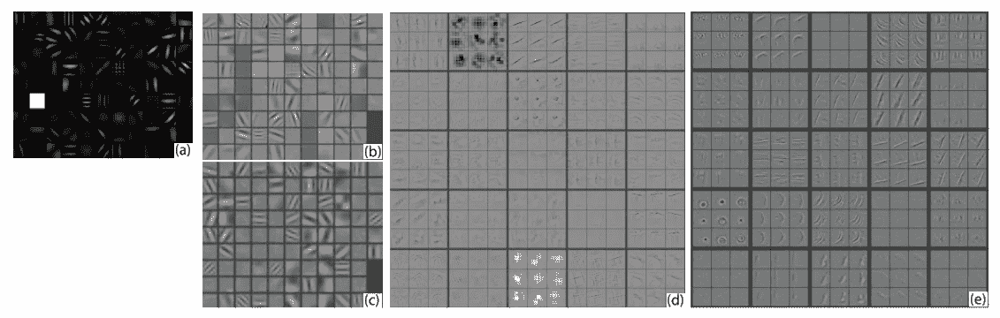

[https://arxiv.org/pdf/1311.2901.pdf](https://arxiv.org/pdf/1311.2901.pdf)

在(b)中，我们有 AlexNet 的第 1 层功能，在(c)中，我们有 ZFNet 的第 1 层功能。在(b)的情况下，我们可以看到一些灰色方块，这些是没有激活值的死亡神经元。这是一件坏事。另一个问题是在(a)中可以看到颜色/强度的低值和高值，但是不能看到颜色/强度的中间范围。

第三个问题是图像特征中的锯齿状视觉特征或混叠。当采样率不够高时，就会发生混叠(想象一下图像中有正方形)。在这种情况下，采样率是将要发生的卷积数。如果滤波器尺寸较大，则采样率较低。如果滤波器尺寸较小，则采样率将会较高。大步流星也会发生同样的事情。

这就是为什么这些问题的解决方案是减小滤波器尺寸和步幅，这两者都导致采样速率增加，并且由于现在步幅很小，颜色/强度的中间范围出现。

# 特征不变性

卷积神经网络具有平移、缩放和旋转(给定对象具有旋转对称性)不变性。这是直观的证据:

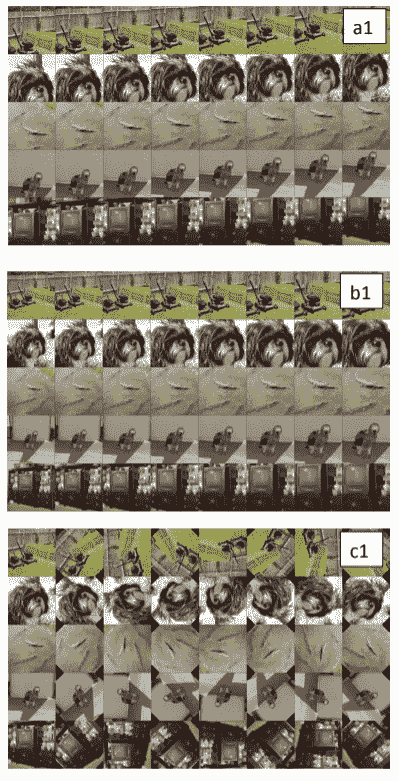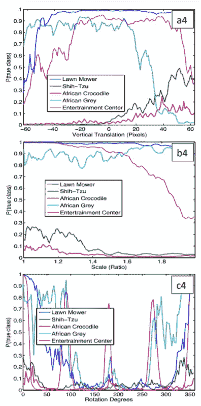

[https://arxiv.org/pdf/1311.2901.pdf](https://arxiv.org/pdf/1311.2901.pdf)

第一行是为了显示翻译不会影响训练有素的 CNN 的表现。在第一行的第二列中，您可以看到图像属于其真实类别的概率。除了在极端情况下，曲线在大多数情况下都是稳定的，主要是因为在图像中不能看到有问题的物体。

第二行是为了显示缩放不影响经过训练的 CNN 的性能。在第二行的第二列中，您可以看到图像属于其真实类别的概率。除了娱乐中心之外，大多数对象的曲线都是稳定的，娱乐中心实际上一直类似于电视，因此是这样的行为。但是，总的来说，CNN 看起来对缩放相当稳健。

第三行是为了显示旋转确实会搞乱 CNN。一个例外是，如果物体具有某种旋转对称性，那么 CNN 仍然保留其对该物体图像的预测能力。从第三行的第二列，你可以看到所有的曲线都乱了套，只有可爱的狮子狗和危险的非洲鳄鱼是稳定的，它们的图像看起来都是旋转对称的。CNN 对于具有旋转对称性的物体的旋转是鲁棒的，因此，你应该记住这一点。

因此，今天你就有了视觉证据，证明为什么 CNN 在图像任务上如此出色。

# 特征的演变

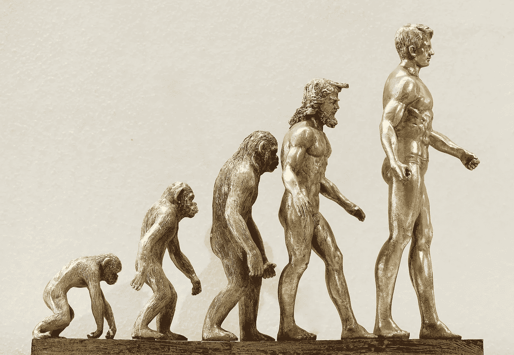

照片由 [Alexas_Fotos](https://pixabay.com/users/Alexas_Fotos-686414/) 拍摄

这篇论文给了我们关于神经网络在引擎盖下做什么的视觉直觉。没有人知道如何处理和如何调整这个引擎的黑盒神经网络已经不再是谜了。下图显示了网络中图层的影像要素。

[https://arxiv.org/pdf/1311.2901.pdf](https://arxiv.org/pdf/1311.2901.pdf)

这就是图像特征如何在层上演变，但用简单的自然语言来说，这就是它是如何发生的。

来源:作者

对这一观点的更多支持是，在第一层，你有线，我们可以把它联系起来，因为这两个方程看起来像:

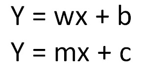

来源:作者

正常神经元的方程式看起来像一条线。所以，第一层模拟图像中的线条。随着层数的增加，上面的 x 会越积越多。并且网络对越来越多的扭曲线及其组合进行建模。耶，我们得到了最好的算法来创建我们的模型。对于以上解释的更复杂的形式，请查阅通用逼近定理(UAT)和柯尔莫哥洛夫定理。

# 特征重要性

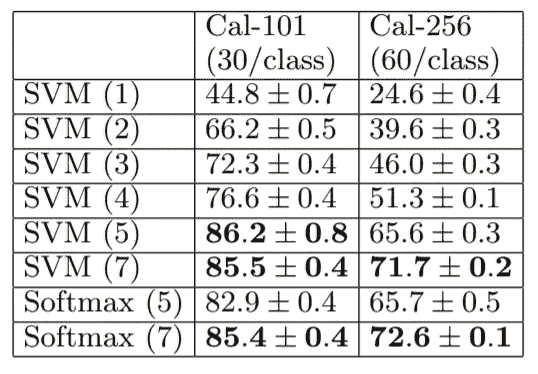

https://arxiv.org/pdf/1311.2901.pdf

精彩的部分还不止于此。本文还包含有关各图层特征预测能力的有用信息。正如我们所见，最后一层功能是最强大的。因此，在堆叠或迁移学习时，这些都可以使用。

# 密码

这里是上面广泛讨论的 awesome 网络的代码。

# 结论

ZFNet 第一次让世人看到了神经网络的内心世界。由于人类是视觉学习者，这为计算机视觉领域打开了新的大门和途径。它向我们展示了神经网络的中心思想以及它们是如何形成的。