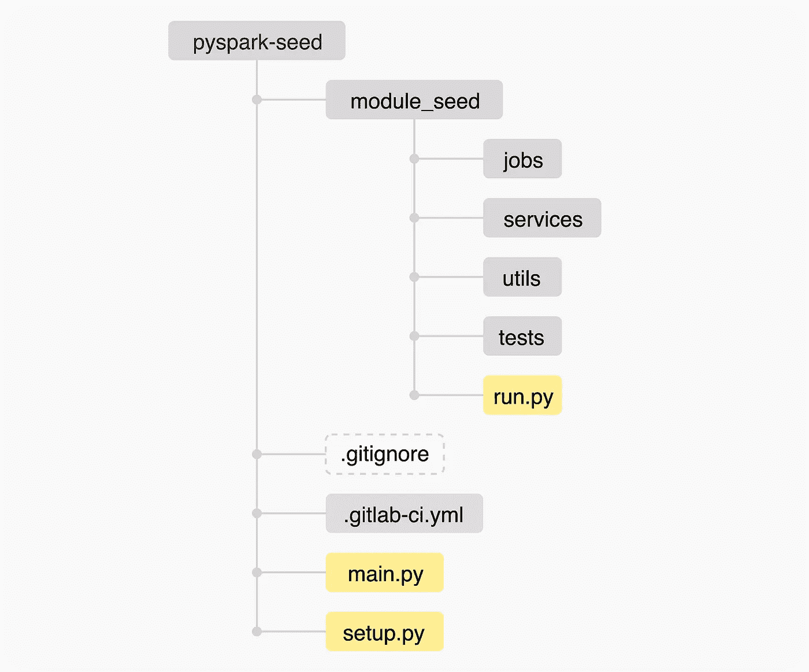
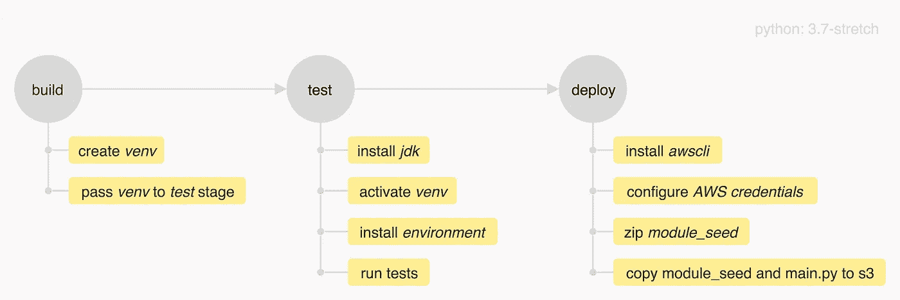
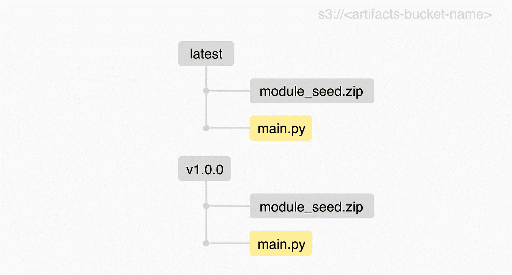
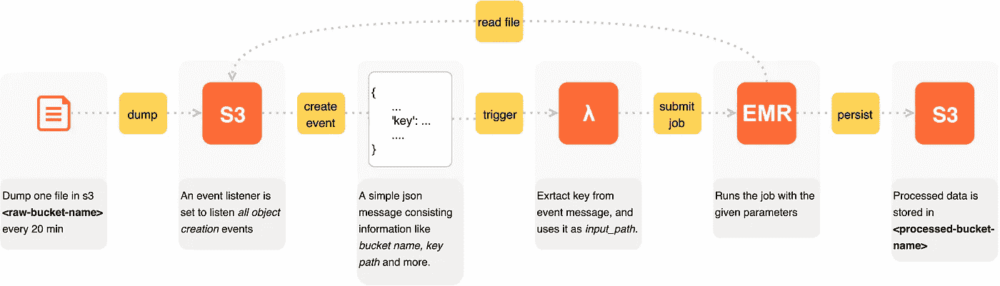

# 通过 Lambda 函数在 EMR 中压缩和提交 PySpark 作业

> 原文：<https://towardsdatascience.com/zipping-and-submitting-pyspark-jobs-in-emr-through-lambda-functions-46a58a496d9e?source=collection_archive---------28----------------------->

## 端到端的项目结构和部署


Denys Nevozhai 在 [Unsplash](https://unsplash.com?utm_source=medium&utm_medium=referral) 上拍摄的照片

# 语境

我假设你已经熟悉 AWS 云平台，尤其是 Lambda 和 EMR 服务。我假设您已经运行了一个 EMR 集群，并且知道如何设置 lambda 函数。本文涵盖了创建 PySpark 项目并提交给 EMR 的端到端主题。最后，本文产生了一个名为 *pyspark-seed* 的 PySpark 项目，它已经准备好被克隆并在它的基础上进一步开发。

# 重要的事情先来

我的 Python 项目的 go to IDE 是 *PyCharm* 。Jupyter 笔记本总是在那里快速检查。为了构建 Python 虚拟环境，我将使用 *venv* 。Venv 很简单，并且预装了 Python 解释器。对于 Python，我会选择 3.7 版本；对于 PySpark，我会选择 2.4.5 版本。提供了一个持续集成配置文件，可以通过 GitLab Runner 执行。由于社区更大，我也在 GitHub 中托管这个 *pyspark-seed* 项目的源代码。

## 部署模式

在创建项目之前，让我们讨论一下部署！是的，部署发生在最后，但是它的重要性应该在项目开始时讨论。为什么？因为大多数时候，你部署项目的方式会影响项目结构和代码组织。

在 PySpark 项目中，您可以部署*独立脚本*或者部署*打包/压缩的*项目。如果你有几个简单的工作，但彼此之间不共享功能，就部署独立脚本。当您有多个彼此共享功能的作业时，部署一个*打包/压缩的*项目。

当打包用 Java 或 Scala 编写的 spark 作业时，您会创建一个单独的 *jar* 文件。如果打包正确，在 EMR 中提交这个 jar 文件将会成功地运行作业。要在 EMR 中提交 PySpark 项目，您需要具备以下两点:

*   您的项目的一个 *zip 文件*。
*   这个 zip 文件之外的一个 *main.py* 文件，它将这个 zip 文件作为一个模块导入。您不必指定*。导入模块时压缩*。

## 构建项目

我创建了一个名为 *pyspark-seed* 的 Python 项目。该项目的结构如下:



pyspark-seed 项目结构

*   *模块 _ 种子*:包含*作业*、*服务*、*实用程序*和*测试*的模块。这可以被认为是一个独立的模块，内部有一个 *run.py* 文件。该文件被导入到 *main.py.* 中
*   *作业*:我存储所有作业的包。
*   *服务*:自定义编写的函数，在作业内部调用，处理数据。这些函数抽象了作业中使用的共享功能。例子可能是:*模式服务、日期服务*等。
*   *utils* : 一个包，我在里面存放了像 *s3_utils、spark_utils、log_utils* 等助手。(是的 utils 的意思和 helpers 一样)。
*   测试:存储单元和集成测试的包。
*   *。gitignore* :通常由 [gitignore.io](http://gitignore.io/) 生成。
*   *main.py:* 这是主函数，在部署时，它将被保存在 zip 文件之外。该文件从*模块种子*包中导入 *run.py* 并运行它。
*   *setup.py:* 安装这个项目。

## 虚拟环境

我使用 *venv* 来创建隔离的 Python 环境。这个环境中的 Python 二进制文件与您用来创建这个环境的 Python 中的二进制文件是相同的。安装在这个虚拟环境中的模块独立于安装在本地/系统 Python 中的模块。要创建 Python 环境，请在项目根目录(即/pyspark-seed)。

```
python3 -m venv venv. ./venv/bin/activate pip install -e .
```

第一个命令创建一个 Python 环境。这将在你的项目结构中创建一个名为 *venv* 的目录。第二个命令将激活创建的 Python 环境。最后一个命令将运行 *setup.py* 并安装/设置项目。

## 安装文件

该文件的职责是正确设置您的 Python 项目。您可以指定项目的*名称*、版本*、*提供项目的*描述*、*作者*名称、*包*等等。一个简单的 *setup.py* 如下:

在 *__version__* 变量中指定项目版本，允许您在 CI 期间访问它，并使用它来生成一个路径，在那里您将在 s3 中存储工件(即 *seed_module* 和 *main.py* )。访问这个变量非常简单:

```
python setup.py --version
```

## CI-管道

PySpark 项目的 CI 管道通常有三个基本阶段:*构建*、*测试、*和*部署。*



pyspark-seed 项目的线性 CI 渠道

Python *3.7-stretch* 用作基础图像。如果您想在测试阶段安装 PySpark 并运行 PySpark 测试，那么这个版本是必需的。这条管道是线性的。每个阶段在前一个阶段成功完成后运行。阶段*构建*和*测试*自动运行，而*部署*应该手动触发以进行部署。AWS 凭证作为环境变量存储在 GitLab 中。当在 s3 中存储工件时，我们总是用最新的变更覆盖*最新的*路径内容。



s3 中部署的工件

# 乔布斯

每个作业都应该写在单独的 Python 文件中。为了简单起见，每个作业都应该有一个名为 *process* 的函数，它至少接收 *spark_session* 、 *input_path* 和 *output_path* 作为参数。这些参数，即我们想要运行的作业名和其他参数，在下一节讨论的 lambda 函数中指定。下面显示了一个简单的作业模板。

# 通过 Lambda 向 EMR 提交作业

AWS Lambda 是一种无服务器服务。您可以通过 AWS CloudWatch 安排 lambda 代码运行，触发代码运行作为对事件的响应，甚至通过 API 调用按需触发 lambda 函数。下面展示了一个向 EMR 提交作业的 lambda 函数。这个 lambda 函数在 Python 3.7 中运行。

我已经定义了 *main_path* 和 *modules_path* ,它们默认指向产品的*最新*版本。特定于您的 *main* 函数的参数在 *main_path 之后的 *spark-submit* 中传递。*我更喜欢在字典中设置所有参数，将字典转换为字符串，并将整个字符串作为单个参数传递给 *main。*当收到这个字符串字典时，我使用 *ast* 模块，从中提取字典。

然后，该参数字典被传递给 *run.py* 函数，该函数使用提供的配置建立 spark 会话，并运行参数中规定的作业。

# 场景工作流

考虑一个用例，其中每 20 分钟将一个数据文件(大小约 3GB)转储到 s3 原始数据桶中。考虑一个事件侦听器被设置到这个桶属性。该事件监听器监听*所有* *对象创建*事件。如果在这个桶中上传了一个对象，侦听器就会捕获它并触发目标 lambda 函数。这个 lambda 函数从事件消息中获取对象路径，提供作业参数，并在 EMR 中提交作业。下图显示了此工作流程的开始和结束。



通过 lambda 函数在 EMR 中提交 PySpark 作业的简单场景

# 最后的话

在本文中，我描述了启动 PySpark 项目、创建 CI 配置文件、在 S3 部署工件以及通过 Lambda 函数在 EMR 中提交作业的过程。提供的大部分建议都直接来自我在生产和研究中使用 PySpark 的个人经验。我在 Github 中托管了这个 *pyspark-seed* 项目的源代码。通过亲自探索这个知识库，可以了解许多其他细节。随意克隆它，让它变得更好。

当然，这个项目许多方面可以用不同的方式来完成。我打算提供这个种子项目作为一个起点，可以进一步发展。欢迎所有问题、反馈和批评。我相信在这个世界上，批评推动变化。

[](https://github.com/dardanxhymshiti/pyspark-seed) [## dardanxhymshiti/pyspark-seed

### 在 GitHub 上创建一个帐户，为 dardanxhymshiti/pyspark-seed 的发展做出贡献。

github.com](https://github.com/dardanxhymshiti/pyspark-seed)