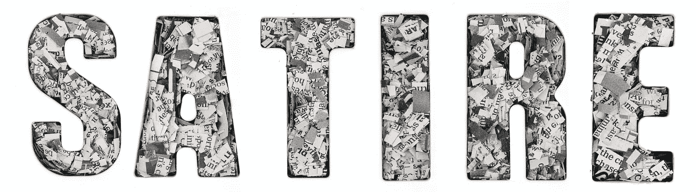
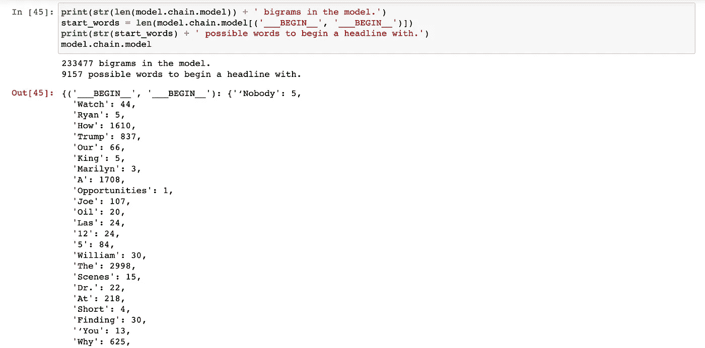
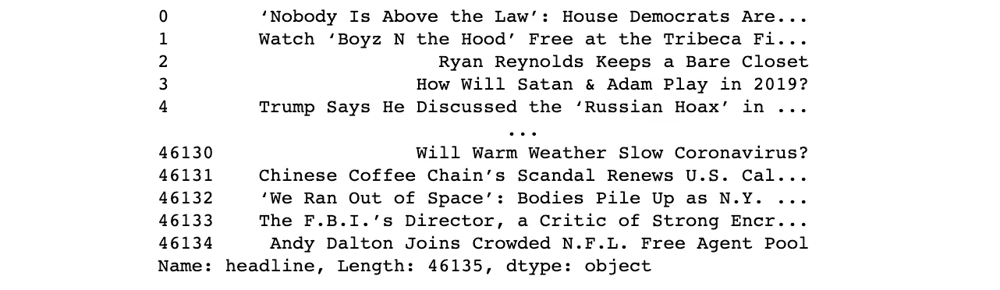
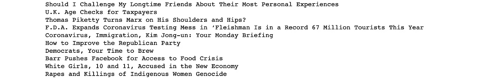

# 总统竞选中服用维柯丁:用马尔可夫链制造假头条

> 原文：<https://towardsdatascience.com/zonked-on-vicodin-in-the-presidential-race-generating-fake-headlines-with-markov-chains-87f06cccd866?source=collection_archive---------56----------------------->

## 在讽刺和现实之间游走



来源:[查尔斯·泰勒](https://stock.adobe.com/contributor/17182/charles-taylor?load_type=author&prev_url=detail)，via [Adobe Stock](https://stock.adobe.com/images/the-word-satire-made-up-of-lots-of-cut-up-newspaper/222594173?prev_url=detail)

在这篇文章中，我们编写 Python 代码来生成假新闻标题，使用马尔可夫链模型，该模型是在过去一年中来自*《纽约时报》*的真实标题语料库上训练的。

一些假标题:

> 我曾经牵过手？
> 
> 我们在下降，下降，下降
> 
> 我们都在这张照片里吗？| 2019 年 9 月 18 日
> 
> 在总统竞选中嗑了维柯丁
> 
> 迈克·彭斯明确表示有一部新宪法
> 
> 谁知道如何清除你孩子的 DNA 信息？
> 
> 人工智能了解到自由主义者也会吃掉他们自己的律师
> 
> 纽约人多么想要便宜的葡萄酒和许多真人大小的洋娃娃。
> 
> 卡罗尔·巴斯金的丈夫唐·路易斯身上发生的一件事？
> 
> 在帮助下，她找到了卡森·麦卡勒斯的情书。他们教她如何统治直到 2036 年

尽管这些标题很明显是假的，而且从未被《纽约时报》发表过，但在当前事件的背景下，它们却有着不可思议的真实性。

假设您有一个想要模拟的文本语料库，您可以扩展本文中的代码来生成任何想要的文本。

**内容:**

1.  马尔可夫链是如何工作的
2.  野外的马尔可夫链文本生成器
3.  创建我们自己的马尔可夫链文本生成器
4.  制造假标题
5.  改进我们模型的方法
6.  更多头条！

# 1.马尔可夫链是如何工作的

你可能没有意识到，但是你每天都在使用马尔可夫链。这些数学系统决定了哪些页面会出现在谷歌搜索的顶部。它们帮助你的手机预测你下一步要输入什么。它们还为各种 Twitter 和 Reddit 机器人以及其他模仿发生器提供动力。

从根本上说，所有这些应用程序中的马尔可夫链都是以同样的方式工作的。马尔可夫链描述了一系列可能的状态，其中每个状态的概率取决于紧接在其之前的状态。

马尔可夫链上有很多好的资源，比如[这个](https://setosa.io/ev/markov-chains/)可视化的，所以这篇文章只描述它们如何在 Python 包[**markovify**](https://github.com/jsvine/markovify)**，**中工作，这是一个方便的小包，可以让我们自己委托编写模型的工作。

当给定像我们的标题这样的语料库时， **markovify** 使用重叠滑动窗口将每个句子(或者在我们的情况下，标题)分解成用户指定大小的 n 元语法状态。例如，如果我们告诉它，我们希望我们的语料库用二元模型状态的马尔可夫链来建模，这个标题来自 2020 年 4 月 30 日

> 谁应该在飞机上戴口罩？更多的航空公司说每个人

被分解成这个二元模型状态列表:

```
('___BEGIN__', '___BEGIN__')
('___BEGIN__', 'Who')
('Who', 'Should')
('Should', 'Wear')
('Wear', 'Masks')
('Masks', 'on')
('on', 'Planes?')
('Planes?', 'More')
('More', 'Airlines')
('Airlines', 'Say')
('Say', 'Everyone')
```

当它把这个标题分解成 n 个字母时， **markovify** 也在字典中记录了遵循特定二元模型的所有单词的频率。这本字典构成了马尔可夫链。

到目前为止，我们的马尔可夫链是这样的:

```
{('___BEGIN__', '___BEGIN__'): {'Who': 1},
('___BEGIN__', 'Who'): {'Should': 1},
('Who', 'Should'): {'Wear': 1},
('Should', 'Wear'): {'Masks': 1},
('Wear', 'Masks'): {'on': 1},
('Masks', 'on'): {'Planes?': 1},
('on', 'Planes?'): {'More': 1},
('Planes?', 'More'): {'Airlines': 1},
('More', 'Airlines'): {'Say': 1},
('Airlines', 'Say'): {'Everyone': 1},
('Say', 'Everyone'): {'___END__': 1}}
```

再来看另一个标题。

> 应该先救谁？专家提供伦理指导

在 **markovify** 分解这个标题并更新链之后，我们的链看起来是这样的(更新以粗体显示):

```
{('___BEGIN__', '___BEGIN__'): **{'Who': 2}**,
('___BEGIN__', 'Who'): **{'Should': 2}**,
('Who', 'Should'): {'Wear': 1, **'Be': 1**},
('Should', 'Wear'): {'Masks': 1},
('Wear', 'Masks'): {'on': 1},
('Masks', 'on'): {'Planes?': 1},
('on', 'Planes?'): {'More': 1},
('Planes?', 'More'): {'Airlines': 1},
('More', 'Airlines'): {'Say': 1},
('Airlines', 'Say'): {'Everyone': 1},
('Say', 'Everyone'): {'___END__': 1},
**('Should', 'Be'): {'Saved': 1}**
**('Be', 'Saved'): {'First?': 1},
('Saved', 'First?'): {'Experts': 1},
('First?', 'Experts'): {'Offer': 1},
('Experts', 'Offer'): {'Ethical': 1},
('Offer', 'Ethical'): {'Guidance': 1},
('Ethical', 'Guidance'): {'___END__': 1}**}
```

我们可以看到模型知道单词“Who”在标题中作为第一个单词出现了两次。该模型还知道“谁应该”后面可能会有两个不同的词，以及标题可以在“说每个人”或“道德指导”后面结束。

最终[和大]链的一瞥:



这是我们马尔可夫链的一部分，它从我们的纽约时报标题语料库中捕获了 233，477 个二元模型。

当生成一个句子时， **markovify** 以开始状态`('___BEGIN__', '___BEGIN__')`或用户提供的开始状态开始，可能是`('More', 'Airlines')`或其他 233，476 个二元模型中的任何一个。

**Markovify** 然后从这个开始状态开始链接，随机添加一个单词，假设它跟随前面的二元模型。当链遇到结束状态时，它停止。现在我们有了假标题。

使用马尔可夫链生成文本时会出现一些常见的问题，但是 **markovify** 在幕后处理了这些问题。这些问题与生成句子片段而不是完整的句子有关。如果我们从一个随机的单词开始，去掉标点符号，或者试图在一定数量的单词后任意结束句子，就会发生这种情况。 **Markovify** 通过记录所有可能的首字、保留所有标点符号、记录所有结束状态来处理这些问题。Markovify 还确保我们不会生成语料库中已经存在的句子。

# 2.野外的马尔可夫链文本生成器

虽然马尔可夫链文本生成器可以进行微调或与其他模型结合，以创建强大的应用程序，如谷歌搜索或手机上的预测文本，但它们也只是一种使用非常简单的快捷方式模仿智能的有趣方式。

马尔可夫链文本生成器的一些例子:

*   [链发明精神错乱](http://chainsinventinsanity.com)，一个反人类的卡片答题卡生成器。
*   [/u/user_simulator](https://www.reddit.com/user/user_simulator) ，一个基于用户评论历史生成评论的 Reddit 机器人。
*   [Insta-Trump！](http://trump.frost.works/)，特朗普演讲生成器。
*   Tay ，这是一款微软聊天机器人，它被设计成基于与 Twitter 上的人的互动来做出回复。然而，它在不到 24 小时内变成了[一个热爱希特勒的性爱机器人](https://www.forbes.com/sites/erikkain/2016/03/24/microsofts-teenage-nazi-loving-ai-is-the-perfect-social-commentary-for-our-times/#b91dbb4235a0)，这要感谢巨魔给它提供了煽动性和攻击性的推文，并立即被拿下。
*   [shartificialintelligence.com](http://www.shartificialintelligence.com/)，“世界上第一家完全由机器人文案组成的创意广告公司。”

# *3。创建我们自己的马尔可夫链文本生成器*

为了创建我们自己的马尔可夫链文本生成器来生成模仿纽约时报的假标题，我们首先需要获得真实标题的语料库，然后我们使用马尔可夫链在这些标题上训练我们的模型。

## 从《纽约时报》下载真正的头条新闻

我们将使用去年《纽约时报》和《T21》的所有标题。我在这里描述如何得到它们。

[](/collecting-data-from-the-new-york-times-over-any-period-of-time-3e365504004) [## 从《纽约时报》收集任何时期的数据

### Python 中的简单指南

towardsdatascience.com](/collecting-data-from-the-new-york-times-over-any-period-of-time-3e365504004) 

或者，您也可以对任何其他文本语料库执行此操作。文本越多越好。你只需要遵循由 **markovify** 包指定的[格式规则](https://github.com/jsvine/markovify/blob/master/README.md)就可以把它变成一个可用的语料库。

在我们开始之前，加载依赖项。

```
import pandas as pd
import markovify
import random
```

加载独特的标题。

```
headlines = pd.read_csv('NYT.csv', parse_dates=['date']).drop_duplicates(subset='headline').reset_index(drop=True)['headline']
```



《纽约时报》过去一年的独特标题。

我们有 46，135 个标题输入到我们的模型中。

## 使用 markovify 训练我们的模型

为了训练我们的模型，我们给 **markovify** 我们的标题语料库和我们想要的 n 元语法的大小。

```
model = markovify.NewlineText(headlines, state_size=2)
```

我测试了一元模型、二元模型、三元模型，发现二元模型在这种情况下给出了最好的概率一致性，所以这就是我们选择`state_size=2`的原因。

# 4.制造假标题

告诉模型生成一个假标题也很简单。

```
model.make_sentence()
```

我们还可以生成谈论特定话题的标题，比如当前的疫情。由于没有内置的方法来做到这一点，我不断地一个接一个地生成标题，如果它们包含至少一个与主题相关的预先指定的单词列表中的单词，就保留它们，直到我达到我想要的标题数量。

关于疫情的假标题:

> 冠状病毒已经赢了
> 
> 总统赦免冠状病毒本身
> 
> 你的访客应该知道冠状病毒
> 
> 谋杀率惊人。病毒是冲着你来的？
> 
> 冠状病毒成了圣人。但是首先，他的身体必须被释放
> 
> 在充满枪支的漫画世界中半心半意的千禧年冠状病毒准备
> 
> 当冠状病毒衰退时，堕胎是“合适的”
> 
> 波兰和匈牙利利用冠状病毒在美国人中间挑拨离间？
> 
> 冠状病毒导致 N.C.A.A .停止销售假冒的抗冠状病毒牙膏
> 
> 爱泼斯坦原告敦促安德鲁·阿尔伯特·克里斯琴对性玩偶“全盘招供”，玛丽·雪莱创造了“弗兰肯斯坦”，然后是病毒

为了好玩，让我们尝试一个不同的话题——猫！

```
topic = ['cat', 'cats', 'kitty', 'kitten', 'kittens']
```

> 在变焦会议上为一只猫大吵大闹
> 
> 掌握放牧数码猫的艺术
> 
> 我们在衰退？永远养你的猫
> 
> 他 22 磅重的猫太大了，无法保持安全
> 
> 有小狗和小猫的房地产年
> 
> 这些地方可能会没有爆炸的小猫
> 
> 两只猫是美国第一批测试其安全团队的宠物
> 
> 在奥地利，这是一个关于鬼魂、黑魔法和谋杀猫的俗气故事
> 
> 一只黑猫为地球上令人不安的警告承担了一些责任
> 
> 他在变焦会议上扔了一只猫后，他们的浪漫开始了

猫凯伦正要去和《纽约时报》的经理谈一谈。

我们可以将任何单词作为主题*、*的一部分，因为*纽约时报*至少在一个标题中使用过它。这个词出现得越频繁，我们的模型就越有创意。

感谢，jsvine ，让这个过程变得如此简单！

# 5.改进我们模型的方法

这篇文章中的所有标题都是人工策划的。虽然我们的马尔可夫链文本生成器对于这样一个简单的算法表现得非常好，但它只是做了它被告知的事情。我们没有告诉它如何变得有趣。我们没有告诉它英语是如何工作的。我们的模型无法知道它是否有趣，甚至语法是否正确。我们得帮点忙。

正常输出:



这些标题有些有道理，但有些没有。

这是机器人社区内部的一场辩论——对于生成自然语言的机器人，我们应该允许多少人为干预？

听说过 [@horse_ebooks](https://twitter.com/horse_ebooks?lang=en) 吗？这是一个非常受欢迎的 Twitter 机器人，因为人们在他们认为是概率的东西中看到了[的高雅艺术](https://www.theatlantic.com/technology/archive/2013/09/-horse-ebooks-is-the-most-successful-piece-of-cyber-fiction-ever/279946/)。但是当发现[只是有人假装概率](https://www.theguardian.com/media/2013/sep/24/10-reasons-buzzfeed-ruins-everything)时，推特被激怒了。

这是个难题。[一篇关于名为](https://www.vice.com/en_us/article/j5kmzy/headlinetron-comedy-twitter-bot)[@ headlinetron](https://twitter.com/HEADLINERTRON?ref_src=twsrc%5Etfw%7Ctwcamp%5Etweetembed%7Ctwterm%5E996767577396465666&ref_url=https%3A%2F%2Ftwitter.com%2FHEADLINERTRON%2Fstatus%2F996767577396465666)的 Twitter 机器人的文章很好地描述了这一点:

> “如果纯粹是机器人，那就不好笑了。但如果太人性化，就没意思了。没有人希望看到一个纯粹的马尔可夫链生成器生成的随机混杂的单词沙拉，但也没有人希望看到某个家伙假装成机器人，”埃尔南德斯说。

通常答案是生成大量的句子，然后在最少的人工干预下挑选出最好的句子。除了手工策划，我们还可以做其他事情来改进我们的模型(直到它变得太好而不好笑):

*   增加语料库的大小。
*   与其他模型结合以创建集合模型。
*   使用其他算法，例如神经网络(尽管我进行了初步测试，将 **markovify** 与 [textgrnn](https://github.com/minimaxir/textgenrnn) 进行对比，结果 **markovify** 胜出)。

# **6。更多头条！**

> 寻找一个棘手的情况
> 
> 中国审查人员的工作日记
> 
> 医生来拯救 2020 年夏天
> 
> 我们从纽约时报学到了什么
> 
> 内衣广告失去了如履薄冰的艺术
> 
> 脸书是如何试图将“玉米卷星期二”注册为商标的
> 
> 发微博抱怨我偏执的女房东的难以形容的代价
> 
> 对于一些恐怖小说作家来说，没有什么比学生贷款更可怕的了
> 
> 百老汇关闭了，但它的“施虐者”钢琴家仍然接受请求
> 
> 每周健康问答:我们都在了解你妻子的垃圾