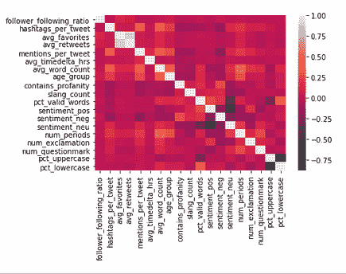
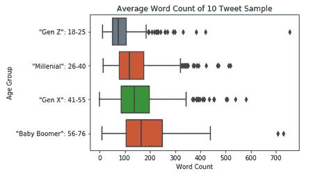
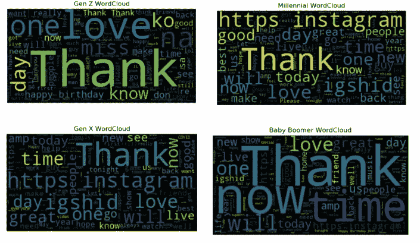
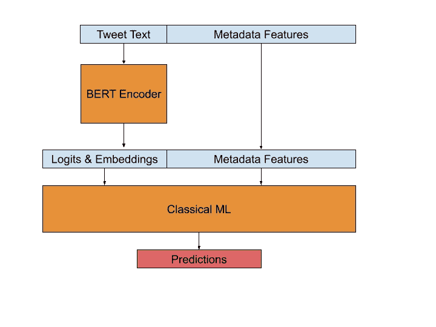
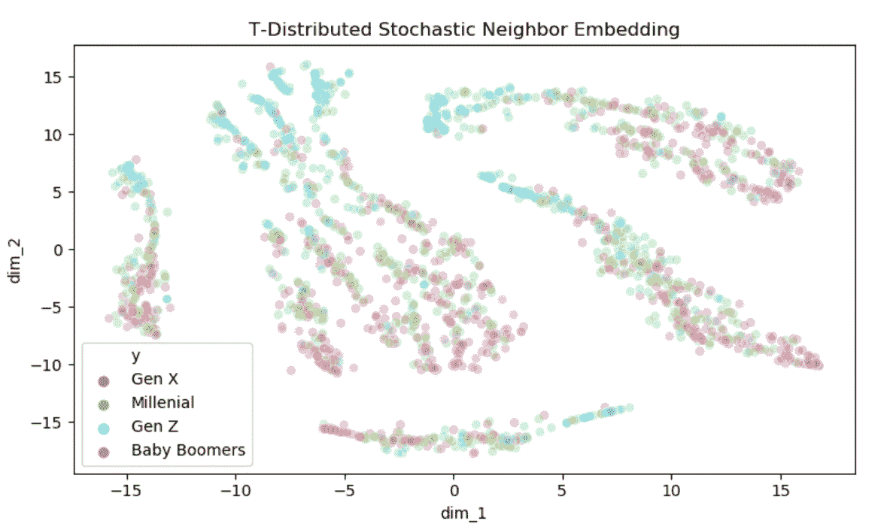
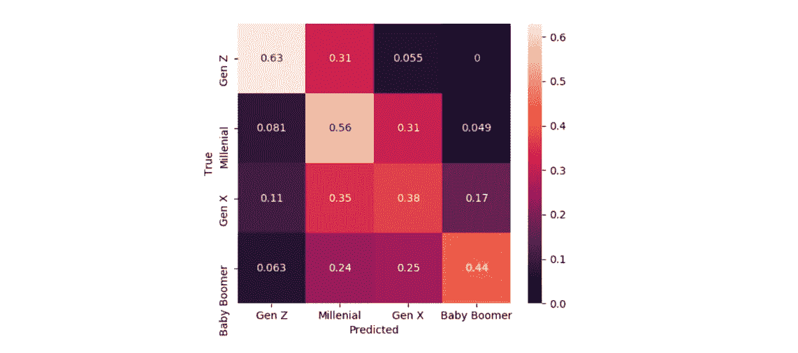
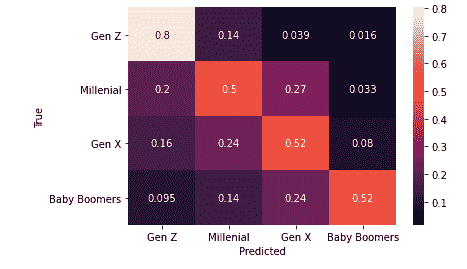
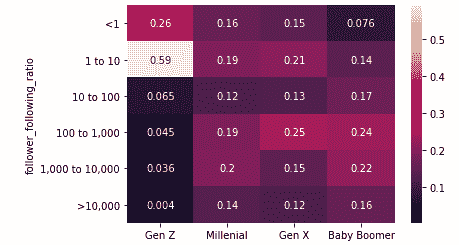

# zoomers vs . Boomers——使用 Transformers 对 Twitter 用户进行世代分类，并进行世代分析

> 原文：<https://towardsdatascience.com/zoomers-vs-boomers-5851a0df885d?source=collection_archive---------47----------------------->

*作者:胡安·帕埃斯人、布伦特·鲍斯格、大卫·戴、萨米·坎德克、悉达多·谢特卡尔和伊迪·周*

这个项目的目标是创建一个模型，根据给定 Twitter 用户的个人资料和推文的内容对他们进行分类。年龄分类的应用可以包括有针对性的数字体验，以及年龄验证和分析各年龄组的流行趋势。发表在《PLOS 一号》上的研究也启发了这个项目(【https://doi.org/10.1371/journal.pone.0183537】T2)。PLOS 小组使用元数据和推文将推特用户分为三个年龄组。在此基础上，来自 Twitter 的用户信息和他们的推文被收集起来，并按年龄分为四代——Z 世代(18-25 岁)、千禧一代(26-40 岁)、X 世代(41-55 岁)和婴儿潮一代(56-76 岁)。我们试图利用基于从个人资料中收集的元数据和他们过去十条推文的内容的模型对他们进行分类。

我们能够从大约 2300 个分布在四代人之间的 Twitter 个人资料中收集信息。由一个说英语的人运营的 18 岁以上的 Twitter 个人资料被搜集用于 tweets 和元数据来创建我们的数据集。使用这个数据集，基于元数据及其推文的统计细微差别设计了新功能。接下来，我们应用了一种基于迁移学习的方法，对 Google 开发的变压器双向编码器表示(BERT)模型进行了微调。该模型为 tweet 生成嵌入，以捕获上下文信息，并生成逻辑，显示模型的原始预测，即一组给定的 tweet 属于一个类别。

生成的逻辑和嵌入与元数据要素一起用于创建集合模型。测试了各种模型，但 CatBoost 梯度增强是表现最好的，总体精度约为 60%。该模型在 Z 代上存在相对超额表现的问题，因为它以大约 80%的准确度对该组进行了分类。此外，该模型是在来自老一代的较少样本上训练的。我们的模型可以用更多的数据进行改进，包括每个配置文件的 tweets 数和获得的配置文件数，但由于时间限制、GPU 限制和 API 访问，这是不可能的。尽管有这些问题，我们的年龄预测模型比基线随机预测模型提供了巨大的提升。

# 数据采集和预处理

我们曾试图获得官方 Twitter API 密钥，但 Twitter 没有及时回应。因此，一个名为 GetOldTweets3 的非官方 Twitter API 被用来收集数据。这个库允许我们查询符合一般搜索标准的推文，如文本内容、推文位置和推文时间戳。

搜索标准是为不超过一周的推文设置的，包含短语“生日快乐”，括号中有数字年龄及其正确的后缀(例如，“18 日”、“19 日”、“20 日”、“21 日”等)。)从 18 岁到 90 岁。这个短语很重要，因为包含它的推文通常包括生日的个人的 twitter 句柄。例如，“21 岁生日快乐**@人**”暗示**@人**年满 21 岁。因此，使用以下代码为每个年龄组收集了 2000 条符合搜索标准的推文:

数据抓取

然后，符合所需格式的 2000 条推文中的每一条(每个年龄的 2000 条推文中不到 25%符合这种格式)都被抓取到紧接在生日短语之前或之后的 twitter 句柄，以识别庆祝他们生日的用户。从每个用户那里收集了 10 条推文作为样本，每个样本包括生日祝福者的用户名、推文 ID、永久链接、文本内容、发布日期、转发次数和收藏次数、提及次数、标签、推文回复者用户名(如果适用)以及推文的地理位置(如果适用)。然后，对每条抓取的推文进行人工审查，删除使用外语的用户、年龄明显不正确的用户(例如，布兰妮·斯皮尔斯被错误地识别为 70 岁)或其账户属于公司或组织而非个人的用户(例如，Old Spice、BBC 等)发出的推文。)

在查看推文数据集后，来自单个用户的 10 条推文被合并成一个样本，该样本包括用户的所有连接推文的字符串，以及调整后的元数据，如最小、最大和平均转发数和收藏夹数。这样做是为了将每个样本与单个用户相关联，从而将数据集从大约 23，000 个样本减少到大约 2，300 个。此外，个人年龄被重新划分为四个不同的类别。18-25 岁的用户归类为 0 类(“Z 世代”)，26-40 岁的用户归类为 1 类(“千禧一代”)，41-55 岁的用户归类为 2 类(“X 世代”)，56-76 岁的用户归类为 3 类(“婴儿潮一代”)。年龄超过 77 岁的用户被丢弃，尽管此操作并没有显著减小数据集的大小。在为每个用户收集了推文和推文元数据之后，网络搜集库 BeautifulSoup 用于搜集每个用户的关注者和追随者数量，因为这些数量无法通过 GetOldTweets3 获得。

一旦我们的整个数据集被管理，它被分成 80/20 的训练集和测试集。这种在所有团队成员之间共享的静态划分的目的是确保每个团队成员单独测试的模型的分数之间更大的一致性和更准确的可比性。在特征工程之前，生成的数据集包含约 2，300 个样本，每个样本包含 17 个特征。

# 特征工程

收集数据后，基于元数据和自然语言处理(NLP)对推文内容的洞察，生成了附加特征。使用了几个 python 库来生成这些特性:BeautifulSoup 用于抓取元数据，nltk 用于情感分析，better_profanity 用于脏话检测，enchant 用于有效英语检测。下表列出了一些附加功能及其用途说明。

*   追随者/追随比率:知名人士拥有更高的追随者/追随比率。对于那些有更多时间获得声望的老年人来说，这可能是一个指标。
*   收藏夹的平均/最小/最大数量:有很多收藏夹的推文表明用户有一群忠实的追随者。高参与度的用户通常是年轻人和名人。
*   平均/最小/最大转发次数:就像喜欢的次数一样，一条推文的转发次数可以表明用户关注度的高低。这种特征在年轻人和名人中很常见。
*   每条推文的平均标签数:标签被用来关注当前最受年轻用户欢迎的 twitter 趋势。因此，每条推文的大量标签表明用户更年轻。
*   每条推文的平均提及次数:在推文中频繁提及其他用户可能是与其他简档高度互动的指标，这可能表明用户的年龄组。
*   推特频率:我们预计年轻人会比老年人更频繁地发推特。
*   平均字数:我们预计年轻人可能会自发或冲动地发微博，与老年人相比，他们的微博会更短，而老年人可能会发更长、更深思熟虑的微博。
*   情感得分(积极、消极、中立):情感可能表明 twitter 用户的态度，这可能与年龄组相关。
*   标点符号用法:代表标点符号用法的特征可以表明用户在发微博时有多细致或小心，这可以表明年龄组。
*   大写/小写百分比:与标点符号用法类似，不成比例地使用大写或小写可能代表粗心或情绪，这可能表明年龄组。
*   包含脏话、俚语计数、有效单词百分比:这些功能旨在揭示脏话、网络俚语(如 omg、lol、tbh)和正确拼写单词的代际用法差异。我们使用外部库来确定单词是否拼写正确或包含亵渎。

# 探索性数据分析

下图显示了细化数据集中按年龄组划分的推文分布:

按年龄组分列的概况样本分布

由此得出的按年龄组划分的抓取推文分布显示，年轻用户比年长用户有更强的代表性。这在意料之中，因为 Twitter 是最受年轻人欢迎的社交媒体平台。当人工审查个人资料时，许多针对老一辈的“生日快乐”推文实际上是针对公司或组织的，这减少了老年群体的样本量。受此影响最大的是“婴儿潮”一代。

使用以下包含所有特征和目标变量“年龄组”的相关性热图，对不同年龄组的特征分布进行了探究:

特征关联热图

相关矩阵显示，目标变量“年龄组”有几个预测因素，如中性推文情绪、平均字数、每条推文的标签数、每条推文的平均提及数和关注者与关注者的比率。此外，收藏的平均数量和转发的平均数量之间有很强的相关性。平均字数和周期数之间也有轻微的相关性。这些高相关系数意味着这些对中的一个特征可能在训练期间被丢弃，因为两个特征对目标变量具有相似的影响。

接下来，绘制箱线图，以了解特征如何分布在几个年龄组中，从而进一步研究与“年龄组”高度相关的核心特征例如，下面包含的箱线图用于检查四个不同年龄组的 10 个 tweet 样本的平均字数分布。

字数统计框图

这个箱线图清楚地显示了最小 IQR、最大 IQR 和平均字数在老年人群中是如何增加的。这一信息进一步证实了平均字数可以作为可靠的年龄预测指标。

另一个有趣的特征是关注者数量按年龄组的分布。scraper 捕获了所有年龄组的名人账户和非名人账户，但名人在年龄组中的分布可能有所不同。下图显示了按年龄组划分的关注者数量分布情况:

按年龄组分列的追随者分布

这个箱线图表明，被归类为“千禧一代”和“婴儿潮”的名人比被归类为“Z 世代”和“X 世代”的名人更扭曲这些分布。此外,“Z 世代”的追随者数量分布更加紧密，这表明相比之下，名人在其他年龄组中的比例可能过高。或者，这可能是因为与老一代名人相比，来自“Z 世代”的名人相对默默无闻，因此追随者较少。

最后，单词云被生成来可视化不同年龄组在他们的推文中如何使用单词:

年龄组的词云

虽然像“谢谢”和“爱”这样的词在所有年龄组中都很常见，但也有一些词是某些群体所独有的。例如，从 Instagram 上照片和账户的链接中砍掉了“igshid”令牌。这让我们考虑在我们的模型中加入 n-gram 分析。

# 模型

我们希望设计一个模型，利用文本推文风格和元数据趋势(如推文频率或字数)的代际差异。此外，最近在自然语言处理方面的突破性发展使用了深度学习模型，称为变形金刚([https://arxiv.org/abs/1706.03762](https://arxiv.org/abs/1706.03762))被用来将序列表示为嵌入，或包含关于它们所代表的单词和句子的上下文信息的向量。出于这些原因，我们的分类器针对我们的分类任务微调了谷歌著名的双向编码器表示(BERT)模型的预训练版本，并将其结果与我们的元数据和生成的特征进行了集成。我们的模型可以分为如下两个阶段:

1.  在第一阶段，来自 Python huggingface transformer 库的预训练 BERT 模型加载有用于分类的附加线性图层。该模型被调整以优化分类准确性，并且产生的类逻辑和序列嵌入被用作下一阶段的特征。
2.  在第二阶段，元数据特征与由调整的 BERT 模型产生的嵌入和逻辑一起使用，以训练经典的机器学习模型，如随机森林和梯度增强分类器。

模型

## 阶段 1:从 BERT 生成逻辑和嵌入

Python 中的 huggingface 库提供了对预训练的 BERT 模型的访问，这些模型针对特定任务的应用程序进行了优化，这些应用程序是在数十亿个文档上训练的。特别是，*BertForSequenceClassification*提供了一个 PyTorch 模块，该模块由 BERT 编码器组成，并在分类任务的合并输出上添加了一个全连接线性层。因此，我们只需加载模型，训练它以最大限度地提高 Twitter 文本数据的分类准确性，并最终提取其预测逻辑(分类器最后一层的向量代表非规范化预测)和嵌入(来自逻辑之前一层的向量代表每个令牌的上下文信息)。四个提取的 logits 代表了模型对十个 tweet 样本属于四个类别中的每一个的置信度，嵌入是向量，粗略地代表了简档的 tweet 作为一个整体。在嵌入空间中彼此更接近的向量代表上下文相似性。

我们为训练集生成了逻辑和嵌入，方法是将它分成八个块，并一次在七个块上微调一个新模型。八个模型中的每一个都用于为维持块生成嵌入和逻辑。这样做是为了避免信息泄漏，因为模型已经看到了它被训练的数据的标签，并且如果它们也被用于训练，则可能产生过度自信的逻辑或过度具体的嵌入。在对七个训练块进行调优之后，针对维持块对每个模型进行评估。最后一个输出图层的结果包含维持配置文件的 logits，上一个图层的结果包含每个令牌的唯一嵌入。一个新序列的开始由第一个[CLS]分类标记来标记，并且它产生一个代表整个序列的嵌入(【https://arxiv.org/pdf/1810.04805.pdf】)。这是被提取出来用作我们的集合模型的特征的嵌入。

首先，定义以下函数来调整 BERT PyTorch 模块，并从模块的输出中提取嵌入和逻辑:

使用 PyTorch 训练和评估配置文件的函数

接下来，在导入必要的库并将我们的训练集分割成 8 个组块之后，BERT 一次调整 7 个训练组块，将简档的链接 tweets 截断或填充到 512 个令牌(BERT 允许的最大值)，从而为 8 个组块中的每一个生成如下特征:

为训练集提取逻辑和嵌入

一旦为训练集的所有八个组块生成了逻辑和嵌入，就在整个训练集上训练一个最终调整的 BERT 分类器，并用于为整个测试集生成逻辑和嵌入。测试集的特征是通过对整个训练集进行训练而生成的，并对分类器进行如下评估:

为测试集提取逻辑和嵌入

这个深度学习分类器本身在测试集上实现了 50%的准确率，但通过在模型的第二阶段将提取的特征与我们的元数据和其他工程特征进行集成，这个分数得到了提高。

我们使用 t-SNE 维数约简可视化了我们的 tweet 嵌入的可分性。如下所示，减少到二维的微调 BERT 嵌入已经开始显示出一种模式。特别是，Z 世代嵌入和婴儿潮嵌入之间有很多可分性，而来自 X 世代和千禧一代用户的推文产生了类似的嵌入。

微调 BERT 嵌入上的 t-SNE

这一信息得到了测试集上 BERT 分类器的混淆矩阵的支持，如下所示。Z 世代的分类准确率最高，千禧一代和 x 一代之间的困惑最多

## 阶段 2:分类器集成

在这一点上，每个 Twitter 个人资料样本都标有元数据特征以及来自 BERT 分类器的 4 个 logits 和 768 个嵌入元素。这种组合的数据被用作经典机器学习分类算法的输入，我们试图用它来实现比纯文本模型更好的准确性。经过一些超参数调整后，几种不同的模型达到了 50 年代中期的精度，包括逻辑回归、随机森林和梯度增强。

然后，我们使用梯度增强和随机森林模型的特征重要性来消除无用的嵌入特征。在所有的嵌入特征中，只有一小部分被认为是最重要的特征被保留下来。这样做的好处是双重的——它大大减少了我们的模型训练时间，同时也提高了性能。

我们的最终模型是一个基于 CatBoost 库的相当简单的梯度提升分类器，对于这个特定的数据集，它的性能优于 XGBoost 和 LightGBM。交叉验证用于深度调整，迭代次数增加，而学习率降低，以优化我们的准确性。这是结果集合模型，其产生 59.76%的准确度:

简单集合分类器

考虑了其他涉及使用 n 元语法的基于 NLP 的方法，这些方法使用 tweet 样本中出现的前 1000 个最常见的一到四个字符标记来创建特征。这种方法不是很成功，因为 BERT 的逻辑和嵌入比每个 n-gram 特征都要好。这可能是由于稀疏的 n-gram 集，可以通过从不同用户收集更多的 tweet 样本来改善；然而，这也凸显了变形金刚作为 NLP 工具的强大，因为 BERT 能够在同一组 tweets 上产生可分离的特征。

# 分析

最终模型混淆矩阵

总的来说，我们的最佳模型具有 59.76%的总体准确度，这明显优于产生 25%准确度的随机预测器。然而，对混淆矩阵的进一步检查表明，该模型在区分 Z 世代人和其他代人方面明显更好，准确率为 80%。尽管其他几代人 50%的准确率还不错，但这些结果表明，Z 世代人在 twitter 上表现出了与其他几代人明显不同的特征。即使在仅基于文本的模型中，Z 世代的分类准确率也比其他任何一代都高。

回顾我们的最佳模型的特征重要性揭示了一些有趣的结论。根据特征重要性，我们微调的 BERT 模型的输出逻辑和所选嵌入排名靠前，这表明不同代人在网上表达自己的方式存在明显差异。然而，脏话计数和俚语计数功能的排名出奇地低。这表明每一代用户使用脏话和俚语的方式相似，这与互联网上年轻人随意使用脏话和俚语的刻板印象相矛盾。然而，俚语和粗话随着时间的推移会发生快速变化，可以采取措施根据某些单词和短语在几代人之间的流行程度对粗话和俚语进行分类。

此外，以收藏和转发形式出现的用户参与似乎不是非常可靠的年龄预测指标。这表明，不同代人制作的内容质量没有差别。然而，这可能只是群体思维的一个迹象，因为个人倾向于追随与他们观点相同的其他人，这可能会导致一些推文在这些回音室中得到更积极的接收，而不是整个推特群体都接触到它们。

相反，跟随者、跟随者以及跟随者与跟随者的比率是决定世代的非常重要的特征，这回避了模型是名人分类器还是世代分类器的问题。

按年龄组划分的用户关注者热图

按年龄组列出的用户关注率热图

关注者数量和关注者/关注比率的相关热图显示，87%的 Z 世代人的关注者少于 10，000 人，88%的人的关注者/关注比率少于 10，这是用于确定个人推特用户名人地位的软基准。这些数字可能是 Twitter 上非名人和名人之间的百分比。然而，其他三代用户的分布则大不相同，有更多的用户拥有超过 10，000 名追随者，追随者与追随者的比率高于 10。这可以解释 Z 世代和其他几代人之间出现在原始混淆矩阵中的准确性差异的部分原因，这表明 Z 世代类可能被解释为伪非名人类，而其他几代人是伪名人类。

无论如何，Z 世代的优异表现并不能解释所有的差异，因为我们的模型仍然能够区分千禧一代、X 世代和婴儿潮世代，每一代的准确率接近 50%。此外，在通过完全删除关于关注者、转发和收藏的信息来“隐藏”可能创建伪名人类别的信息后，梯度增强分类器仍然能够达到 55%左右的准确率。这是对纯文本模型的一个重大改进，即使在隐藏信息以避免利用我们数据的名人分布之后。

# 结论

我们的模型展示了任何人都可以使用最先进的 NLP 工具来利用来自网络社交媒体的公共信息来创建新的有意义的信息。除了时间限制，最大的困难最终证明是我们缺乏干净、平衡的数据。虽然每个类别的用户数量相似，但大多数老一辈的生日愿望都是针对名人和机构的，这扭曲了我们基于元数据的模型的预测。此外，很难对接近年龄组临界值的个体进行分类，我们的标签程序虽然经过人工审查，但并不完善。也就是说，嵌入在推文和趋势中的信息仍然被有效地利用来创建一个良好的分类器，提供有趣的代际洞察。

例如，千禧一代被证明与婴儿潮一代和 X 一代有着非常相似的特征，尽管他们被老一代人排斥。事实上，仅仅根据推特内容来区分他们和老一代人是非常困难的。另一方面，Z 世代是最容易被推文内容和元数据分开的。这说明了 Z 世代在数字世界中成长的影响，他们在 Twitter 上的可分离性表明，他们对采用新技术的适应使他们能够在如何进行数字互动和交流中发展自己的集体身份。网络俚语和脏话的代际使用差异很小，这表明所有代人都能够适应快速变化的文化规范，从而对流行观点提出了挑战。

展望未来，这些方法不仅限于提取关于社交媒体使用的有趣事实，实际上可以用来对世界产生真正的影响。这项技术可能被证明在年龄分类起着重要作用的应用中是有用的，例如个性化数字体验或广告。此外，我们将基于迁移学习的模型与经典机器学习模型相结合的方法可以应用于利用最先进的 NLP 工具来完成其他重要的分类任务，如自杀预防和捕食者检测。自然，这些应用程序在数据可用性方面都会面临类似的挑战。但随着社会继续拥抱技术，从每天每秒共享的大量新数据中产生知识的新方法将继续出现。